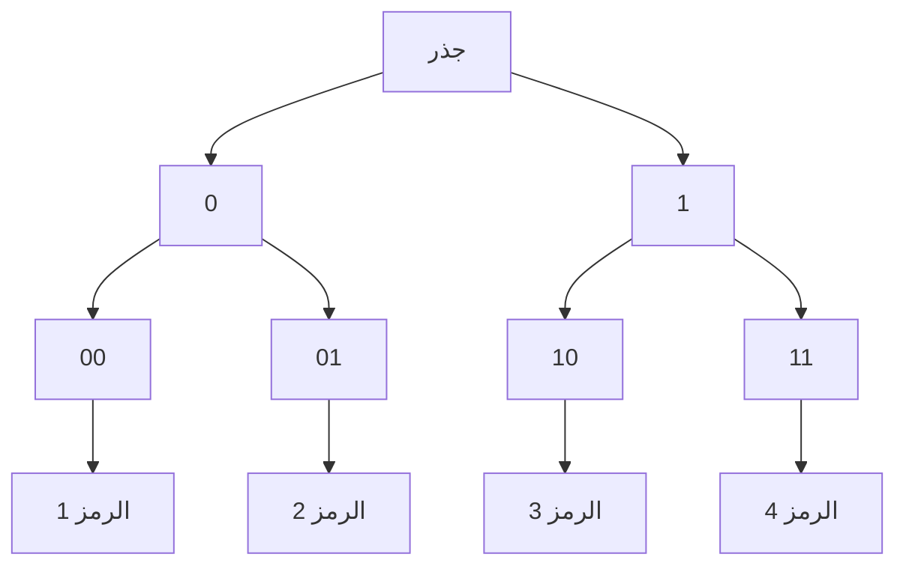
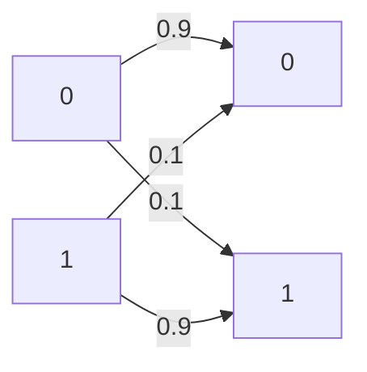

# نظرية المعلومات · Information Theory

## 📐 التعاريف الأساسية · Core Definitions

- **الإنتروبيا** (Entropy): متوسط كمية المعلومات في متغير عشوائي.
- **المصدر** (Source): يُنتج رموزًا من مجموعة أبجدية.
- **قناة** (Channel): وسيلة تنقل المعلومات من المرسل للمستقبل.
- **الترميز** (Coding): تحويل المعلومات لصيغة قابلة للإرسال.
- **الضغط** (Compression): تقليل حجم البيانات.

---

## 📊 الإنتروبيا · Entropy

### تعريف الإنتروبيا · Entropy Definition

$$H(X) = -\sum_{i} p(x_i) \log_2 p(x_i) = \sum_{i} p(x_i) I(x_i)$$

where $I(x_i) = -\log_2 p(x_i)$ is the information content.

### خصائص الإنتروبيا

1. **Non-negativity**: $H(X) \geq 0$
2. **Maximum**: $H(X) \leq \log_2 |X|$
3. **Zero**: $H(X) = 0$ when $p(X) = 1$ (certain event)

### الإنتروبيا المشتركة · Joint Entropy

$$H(X, Y) = -\sum_{x} \sum_{y} p(x, y) \log_2 p(x, y)$$

### الإنتروبيا الشرطية · Conditional Entropy

$$H(Y|X) = \sum_{x} p(x) H(Y|X = x)$$

$$H(X, Y) = H(X) + H(Y|X)$$

```mermaid
flowchart TD
    A[H(X)] --> B[H(X,Y)]
    A --> C[H(Y|X)]
    B --> D[H(X) + H(Y) - I(X;Y)]
    C --> D
```

### قاعدة السلسلة · Chain Rule

$$H(X_1, X_2, \ldots, X_n) = \sum_{i=1}^{n} H(X_i | X_1, \ldots, X_{i-1})$$

---

## 🔢 الترميز والمعلومات · Coding & Information

### متوسط طول الكود · Average Code Length

$$L = \sum_{i} p(x_i) \cdot l_i$$

where $l_i$ is the length of the codeword for symbol $x_i$.

### كود بprefix · Prefix Code

لا يوجد codeword هو بادئة لآخر:



### متراص الحزمة · Channel Capacity

$$C = \max_{p(x)} I(X; Y)$$

bits per channel use.

### نظرية الترميز للضوضاء · Noisy Channel Coding Theorem

$$C = \max_{p(x)} I(X; Y)$$

إذا كان $R < C$، entonces يوجد كود يمكنه تحقيق احتمال خطأarbitrarily small.

---

## 🗜️ الضغط · Compression

### ضغط_without Loss · Lossless Compression

$$H(X) \leq L_{avg} < H(X) + 1$$

### ترميز شانون · Shannon Coding

```python
def shannon_encode(symbols, probs):
    # ترتيب الرموز حسب الاحتمال
    sorted_symbols = sorted(zip(probs, symbols), reverse=True)
    
    codes = {}
    cumulative = 0
    
    for prob, symbol in sorted_symbols:
        lower = cumulative
        upper = cumulative + prob
        codes[symbol] = binary_range(lower, upper)
        cumulative = upper
    
    return codes
```

### ترميز هوفمان · Huffman Coding

```python
import heapq
from collections import Counter

def huffman_encode(text):
    # حساب التكرارات
    freq = Counter(text)
    
    # بناء heap
    heap = [(f, [char]) for char, f in freq.items()]
    heapq.heapify(heap)
    
    # بناء الشجرة
    while len(heap) > 1:
        f1, chars1 = heapq.heappop(heap)
        f2, chars2 = heapq.heappop(heap)
        heapq.heappush(heap, (f1 + f2, chars1 + chars2))
    
    return dict(heap[0][1])
```

**التعقيد:** $O(n \log n)$

### ضغط LZW · LZW Compression

```python
def lzw_compress(data):
    dictionary = {chr(i): i for i in range(256)}
    result = []
    current = ""
    
    for char in data:
        combined = current + char
        if combined in dictionary:
            current = combined
        else:
            result.append(dictionary[current])
            dictionary[combined] = len(dictionary)
            current = char
    
    if current:
        result.append(dictionary[current])
    
    return result
```

---

## 📡 قنوات الاتصال · Communication Channels

### قناة ذات حدين · Binary Channel



### مصفوفة الانتقال · Transition Matrix

$$P = \begin{bmatrix} P(0|0) & P(0|1) \\ P(1|0) & P(1|1) \end{bmatrix}$$

### السعة للقناة الثنائية المتماثلة · BSC Capacity

$$C = 1 - p \log_2 p - (1-p) \log_2 (1-p)$$

where $p$ is the error probability.

### قناة Gaussian · AWGN Channel

$$C = B \log_2\left(1 + \frac{S}{N}\right)$$

where:
- $B$ = bandwidth
- $S$ = signal power
- $N$ = noise power

### نسب الإشارة للضوضاء · SNR

$$\text{SNR}_{dB} = 10 \log_{10}\left(\frac{S}{N}\right)$$

---

## 🎲 المعلومات المتبادلة · Mutual Information

### تعريف المعلومات المتبادلة

$$I(X; Y) = \sum_{x} \sum_{y} p(x, y) \log_2 \frac{p(x, y)}{p(x) p(y)}$$

### خصائص المعلومات المتبادلة

1. **Non-negativity**: $I(X; Y) \geq 0$
2. **Symmetry**: $I(X; Y) = I(Y; X)$
3. **Equality**: $I(X; X) = H(X)$

### العلاقة بين الكميات

```mermaid
flowchart TD
    A[H(X)] --> B[I(X;Y)]
    A --> C[H(X|Y)]
    D[H(Y)] --> B
    D --> E[H(Y|X)]
    B --> F[H(X) + H(Y) - H(X,Y)]
    C --> F
    E --> F
```

$$I(X; Y) = H(X) - H(X|Y) = H(Y) - H(Y|X)$$

---

## 🔐 الترميز للتصحيح · Error Correction Coding

### الكود التكراري · Repetition Code

```python
def encode_repetition(bits, n):
    # تكرار كل bit n مرات
    return ''.join(bit * n for bit in bits)

def decode_repetition(code, n):
    result = []
    for i in range(0, len(code), n):
        chunk = code[i:i+n]
        result.append('1' if chunk.count('1') > n//2 else '0')
    return ''.join(result)
```

### كود بارتيتي · Parity Check

```python
def add_parity(bits):
    ones = bits.count('1')
    return bits + ('1' if ones % 2 == 0 else '0')

def check_parity(bits):
    ones = bits.count('1')
    return ones % 2 == 0
```

### كود هامنغ · Hamming Code

```python
def hamming_encode(data):
    # حساب عدد bits التكرار
    r = 0
    while 2**r < len(data) + r + 1:
        r += 1
    
    # إعداد المصفوفة
    result = list('0' * (len(data) + r))
    data_idx = 0
    
    for i in range(len(result)):
        if i + 1 not in [2**j for j in range(r)]:
            result[i] = data[data_idx]
            data_idx += 1
    
    # حساب bits التكرار
    for j in range(r):
        pos = 2**j
        ones = 0
        for i in range(len(result)):
            if (i + 1) & pos:
                ones += int(result[i])
        result[pos - 1] = str(ones % 2)
    
    return ''.join(result)
```

**المسافة Hamming:** $d_{min} = 3$

### مصفوفة التكافؤ · Parity Matrix

$$H = \begin{bmatrix} 1 & 0 & 1 & 1 \\ 1 & 1 & 0 & 1 \\ 0 & 1 & 1 & 1 \end{bmatrix}$$

### قدرة التصحيح · Error Correction Capability

$$t = \left\lfloor \frac{d_{min} - 1}{2} \right\rfloor$$

---

## 📊 الترميز التفاضلي · Differential Coding

### ترميز DPCM · DPCM

```python
def dpcm_encode(samples, predictor):
    encoded = []
    predicted = 0
    
    for sample in samples:
        error = sample - predictor(predicted)
        encoded.append(error)
        predicted = sample
    
    return encoded

def dpcm_decode(encoded, predictor):
    reconstructed = []
    predicted = 0
    
    for error in encoded:
        sample = error + predictor(predicted)
        reconstructed.append(sample)
        predicted = sample
    
    return reconstructed
```

### Delta Modulation

```python
def delta_modulate(signal, step):
    output = []
    prev = 0
    
    for sample in signal:
        if sample > prev + step:
            output.append(1)
            prev += step
        elif sample < prev - step:
            output.append(0)
            prev -= step
        else:
            output.append(output[-1] if output else 0)
    
    return output
```

---

## 📝 أمثلة محلولة · Worked Examples

### مثال 1: حساب الإنتروبيا

**المعطيات:** $P(X=0) = 0.5$, $P(X=1) = 0.5$

**الحل:**

$$H(X) = -0.5 \log_2 0.5 - 0.5 \log_2 0.5$$

$$= 0.5 \cdot 1 + 0.5 \cdot 1 = 1 \text{ bit}$$

### مثال 2: سعة قناة ثنائية

**المعطيات:** $p = 0.1$ (احتمال الخطأ)

**الحل:**

$$C = 1 - 0.1 \log_2 0.1 - 0.9 \log_2 0.9$$

$$= 1 - 0.1(3.32) - 0.9(-0.152)$$

$$= 1 - 0.332 + 0.137 = 0.805 \text{ bits}$$

### مثال 3: ترميز هوفمان

**المعطيات:** رموز A, B, C, D avec الاحتمالات 0.4, 0.3, 0.2, 0.1

**الحل:**
- A: 0 (0.4)
- B: 10 (0.3)
- C: 110 (0.2)
- D: 111 (0.1)

**متوسط الطول:**
$$L = 0.4 \cdot 1 + 0.3 \cdot 2 + 0.2 \cdot 3 + 0.1 \cdot 3$$
$$= 0.4 + 0.6 + 0.6 + 0.3 = 1.9 \text{ bits/symbol}$$

---

## 📊 جدول مرجعي شامل · Master Reference Table

### الترميز الأساسي · Basic Coding

| الكود | الاستخدام | متوسط الطول |
| ----- | --------- | ------------ |
| **ASCII** | نص | 8 bits/symbol |
| **Huffman** | ضغط | $H(X) \leq L < H(X) + 1$ |
| **Shannon** | ضغط | $L \geq H(X)$ |
| **Arithmetic** | ضغط | close to $H(X)$ |

### قنوات الاتصال · Channels

| القناة | السعة | الظروف |
| ----- | ----- | -------- |
| **BSC** | $1 - H(p)$ | p = error prob |
| **BEC** | $1 - p$ | erasure prob |
| **AWGN** | $B \log_2(1+S/N)$ | Gaussian noise |

### كودات التصحيح · Error Correction

| الكود | المسافة | قدرة التصحيح |
| ----- | ------- | ------------- |
| **Repetition (n)** | n | $(n-1)/2$ |
| **Parity** | 2 | 0 |
| **Hamming (7,4)** | 3 | 1 |
| **Hamming (15,11)** | 3 | 1 |
| **Golay (23,12)** | 7 | 3 |

### وحدات القياس · Units

| الوحدة | التعريف |
| ------ | -------- |
| **Bit** | وحدة أساسية |
| **Nat** | $\ln$ base |
| **Hartley** | $\log_{10}$ base |

---

## ⚠️ أخطاء شائعة وملاحظات · Common Pitfalls & Notes

### ❌ أخطاء شائعة

1. **الخلط بين الإنتروبيا والمعلومات:**
   -$H(X)$: متوسط المعلومات
   - $I(X; Y)$: المعلومات المتبادلة
   - 💡 **ملاحظة**: $I(X; Y) \neq H(X)$!

2. **نسيان +1 في متراص الحزمة:**
   - متراص الحزمة: $H(X) \leq L < H(X) + 1$
   - ليس $H(X) \leq L < H(X)$

3. **عدم فهم شروط القناة:**
   - BSC: Binary Symmetric Channel
   - BEC: Binary Erasure Channel
   - AWGN: Additive White Gaussian Noise

4. **التماثل في هوفمان:**
   - الشجرة يمكن بناؤها بطرق مختلفة
   - النتائج متكافئة وظيفيًا

### 💡 نصائح مهمة

- **متراص الحزمة**: $H(X)$ هو الحد الأدنى
- **سعة القناة**: $C$ هي الحد الأقصى
- **كودات تصحيح الأخطاء**: تضيف redundancy

### 📌 ملاحظات نهائية

- **متراص_source**: إزالة التكرار
- **متراص_channel**: إضافة التكرار
- **الحد**: $R < C$ لتحقيق communication надежный
