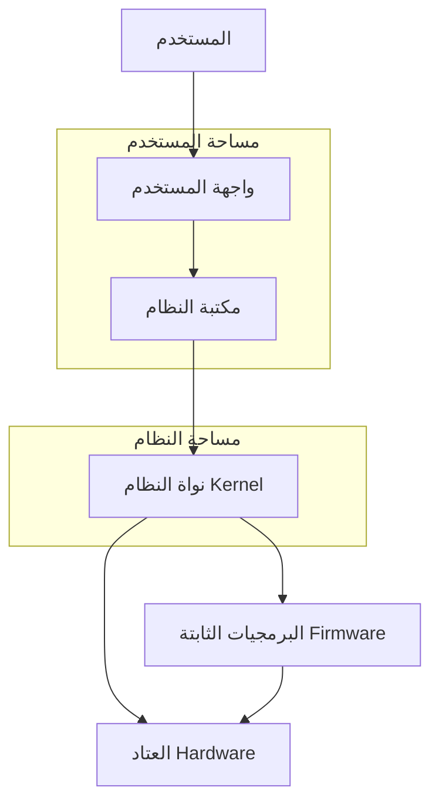
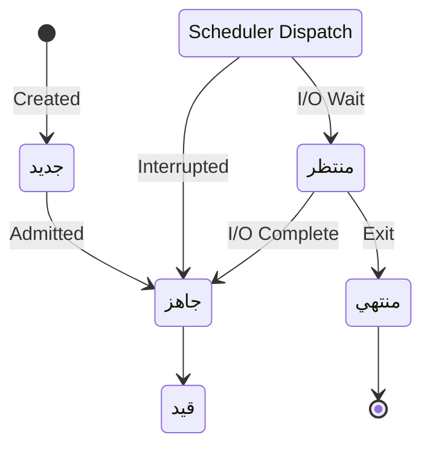
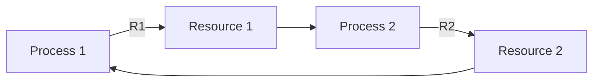

# نظم التشغيل 1 · Operating Systems I

## 📐 التعاريف الأساسية · Core Definitions

- **النظام** (Process): برنامج قيد التنفيذ مع حالته وموارده.
- **الخيط** (Thread): وحدة Lightweight خفة التنفيذ ضمن عملية.
- **الجدولة** (Scheduling): تحديد ترتيب تنفيذ العمليات.
- **الإدارة** (Memory Management): تخصيص الذاكرة وإطلاقها.
- **الجمود** (Deadlock): حالة توقف永久ى where العمليات متوقفة بشكل متبادل.
- **نظام الملفات** (File System): تنظيم البيانات على التخزين.

---

## 🔁 نموذج النظام · System Model

### بنية النظام · System Structure



### حالات العملية · Process States



---

## 🧮 النظريات والصيغ · Theorems & Formulas

### معايير الجدولة · Scheduling Criteria

- **URNaround Time** ($T_r$): زمن الانتظار + زمن التنفيذ
  $$T_r = T_{completion} - T_{arrival}$$

- **Waiting Time** ($T_w$): زمن الانتظار في قائمة الجاهزية
  $$T_w = T_{wait}$$

- **Response Time** ($T_{resp}$): الزمن حتى الاستجابة الأولى
  $$T_{resp} = T_{first\_execution} - T_{arrival}$$

### خوارزميات الجدولة · Scheduling Algorithms

| الخوارزمية | الوصف | $T_w$ | $T_r$ | الاستخدام |
| ---------- | ----- | ----- | ------| ---------- |
| **FCFS** | First Come First Sversed | طويل | طويل | بسيط |
| **SJF** | Shortest Job First | الأمثل | الأمثل | الدفعية |
| **SRTF** | Shortest Remaining Time | الأمثل | الأمثل | التفاعلي |
| **RR** | Round Robin | جيد | جيد | التفاعلي |
| **Priority** | حسب الأولوية | — | — | متعدد المستويات |

### معادلات إدارة الذاكرة · Memory Management Equations

- **التجزئة الثابتة** (Fixed Partitioning):
  $$n = \lfloor \frac{M}{k} \rfloor$$
  حيث $M$: الذاكرة الكلية، $k$: حجم القسم

- **التجزئة الديناميكية** (Dynamic Partitioning):
  $$H = \sum h_i$$
  where $h_i$: الثقوب الحرة

- **المساحة الضائعة** (Internal Fragmentation):
  $$F_{int} = k - \text{request}$$

- **الخوارزميات البديلة**:
  - First Fit: $O(n)$
  - Best Fit: $O(n \log n)$
  - Worst Fit: $O(n)$

---

## ⚙️ إدارة الجمود · Deadlock Management

### شروط الجمود · Coffman Conditions

1. **الاستبعاد المتبادل** (Mutual Exclusion): مورد واحد لكل عملية
2. **الانتظار والحيازة** (Hold and Wait): تحتفظ بمورد وتطلب آخر
3. **عدم الاختزال** (No Preemption): لا يمكن إجبار الإفراج
4. **الانتظار الدائري** (Circular Wait): سلسلة دائرية من العمليات



### استراتيجيات behandling · Handling Strategies

| الاستراتيجية | الوصف | الميزة | العيب |
| ---------- | ----- | ------ | ----- |
| **الوقاية** | Prevent واحدة من الشروط | آمن | غير فعّال أحيانًا |
| **التجنب** | Avoid deadlock at runtime | مرن | overhead عالي |
| **الكشف** | Detect ثم recover | عملي | قد يفقد البيانات |
| **التجاهل** | Ignore assume no deadlock | بسيط | خطير |

### خوارزميات الكشف · Detection Algorithms

- **خوارزمية المصرفي** (Banker's Algorithm):
  - Work = Available
  - Finish = false لـ كل العمليات
  - Find Process with Finish[op]=false and Need ≤ Work
  - Update Work += Allocation

---

## 📊 جدول مرجعي · Reference Tables

### جدول أنواع الذاكرة · Memory Types

| النوع | السرعة | السعة | الاستخدام |
| ------ | ----- | ------| ---------- |
| **Register** | 1 ns | 1 KB | تخزين مؤقت |
| **Cache L1** | 2 ns | 32 KB | التعليمات |
| **Cache L2** | 10 ns | 256 KB | البيانات |
| **Cache L3** | 20 ns | 8 MB | مشترك |
| **RAM** | 100 ns | 8 GB | البرامج |
| **Disk** | 10 ms | 1 TB | التخزين الدائم |

### جدول أنظمة الملفات · File Systems

| النظام | год |_max | المميزات |
| ---------- | ----- | ------|---------- |
| **FAT32** | 1996 | 4 GB | بسيط، محمول |
| **NTFS** | 1995 | 16 TB | أمان، ضغط |
| **ext4** | 2008 | 16 TB | Linux default |
| **APFS** | 2017 | no limit | macOS |
| **exFAT** | 2006 | 16 PB | فلاشات |

---

## 📝 أمثلة محلولة · Worked Examples

### مثال 1: حساب زمن الانتظار لـ SJF

**المعطيات:**
| العملية | Arrival | Burst |
|---------|---------|-------|
| P1 | 0 | 7 |
| P2 | 2 | 4 |
| P3 | 4 | 1 |
| P4 | 5 | 4 |

**الحل:**
1. P1 تبدأ عند 0، تنتهي عند 7
2. عند 2: P2 تصل، P1 قيد التنفيذ
3. P2 تبدأ عند 7، تنتهي عند 11
4. P3 تبدأ عند 11، تنتهي عند 12
5. P4 تبدأ عند 12، تنتهي عند 16

**زمن الانتظار:**
- P1: 0
- P2: 7 - 2 = 5
- P3: 11 - 4 = 7
- P4: 12 - 5 = 7
- المتوسط: 19/4 = 4.75 ✓

### مثال 2: حل حالة جمود

**المعطيات:** P1 و P2 تتنافسان على R1 و R2

**الحل (تجنب):**
```python
def request(resource):
    if safe():
        allocate()
    else:
        wait()
```

---

## ⚠️ أخطاء شائعة وملاحظات · Common Pitfalls & Notes

### ❌ أخطاء شائعة

1. **الخلط بين deadlock و starvation:**
   - Deadlock: العمليات متوقفة بشكل permanent
   - Starvation: عملية واحدة لا能够得到 موارد (لكن others تستمر)
   - 💡 **ملاحظة**: يمكن أن تحدث معًا!

2. **الخلط بين thread و process:**
   - Process: ذاكرة منفصلة
   - Thread: ذاكرة مشتركة within process
   - Thread أخف وزنًا من Process

3. **نسيان مفهوم thrashing:**
   - عندما الذاكرة ممتلئة بشكل excessيفي
   - CPU spend وقت في التبديل أكثر من التنفيذ!
   - الحل: increase memory or reduce processes

4. **عدم فهم page fault:**
   - الصفحة غير موجودة في الذاكرة
   - يتم إحضارها من القرص (بطيء!)
   -_types:
     - Minor: صفحة في الذاكرة
     - Major: يجب إحضارها من القرص
     - Invalid: خطأ في البرنامج

### 💡 نصائح مهمة

- **قاعدة PFScheduling:**
  - CPU-bound: RR مع quantum كبير
  - I/O-bound: RR مع quantum صغير

- **إدارة الذاكرة:**
  - Working Set: عدد الصفحات النشطة
  - Page Fault Frequency: يتحكم في عدد الصفحات

- **أنماط deadlock:**
  - Prevention: منع شروط Coffman
  - Avoidance: استخدام Banker's Algorithm
  - Detection: periodic تشغيل graph

### 📌 ملاحظات نهائية

- **Kernel Mode** vs **User Mode**:
  - Kernel: الوصول للعتاد directly
  - User: وصول محدود، syscall للkernel

- **Context Switch**:
  - حفظ الحالة old process
  - تحميل الحالة new process
  - overhead عالي!

- **Scheduler** vs **Dispatcher**:
  - Scheduler: يقرر أي_process gets CPU
  - Dispatcher: ينقل control للحالة المختارة