# نظم تشغيل 2 · Operating Systems 2 (Year 4 - Semester 2)

## 🌐 الأنظمة الموزعة · Distributed Systems

### مفهوم النظام الموزع · Distributed System Concept

- **النظام الموزع** (Distributed System): مجموعة من الحواسيب المستقلة تعمل كأنها نظام واحد.
- **الهدف**: تحقيق التوازي بين الأداء والموثوقية والتوسع.

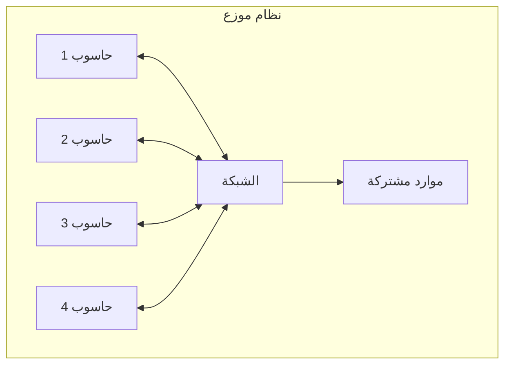

### خصائص الأنظمة الموزعة

| الخاصية | الوصف |
|---------|-------|
| **التوازي** (Concurrency) | تنفيذ多个 مهام بشكل متزامن |
| **الشبكة** (Network) | التواصل عبر الشبكة |
| **الاستقلالية** (Independence) | كل عقدة مستقلة |
| **الشفافية** (Transparency) | إخفاء التعقيد عن المستخدم |

### مزايا وعيوب · Pros & Cons

| المزايا | العيوب |
|---------|-------|
| توصيل موارد متعددة | تعقيد الشبكة |
| تقاسم الحمل | مشاكل التزامن |
| موثوقية عالية | أمان معقد |
| توسع سهل | تكلفة عالية |

---

## 🔄 الذاكرة الموزعة · Distributed Memory

### نموذج الذاكرة · Memory Models

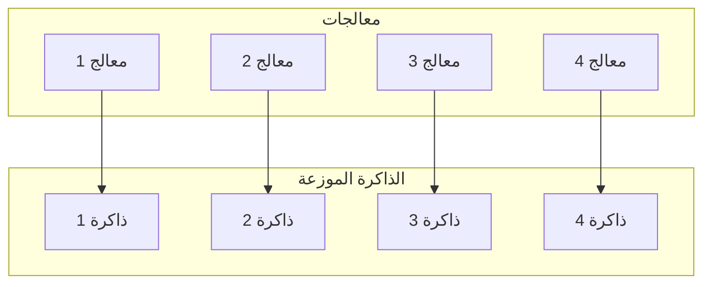

### أنماط الوصول · Access Patterns

| النمط | الوصف | الاستخدام |
|-------|-------|-----------|
| **UMA** | وصول موحد للذاكرة | ذاكرة مشتركة |
| **NUMA** | وصول غير موحد | أنظمة كبيرة |
| **NORMA** | ذاكرة موزعة فقط | أنظمة موزعة |

### تقنيات التواصل · Communication Techniques

#### 1. تمرير الرسائل (Message Passing)

```python
# إرسال
send(destination, message)

# استقبال
receive(source, message)
```

#### 2. الذاكرة المشتركة الموزعة (DSM)


---

## 🔒 التزامن · Synchronization

### مشاكل التزامن · Synchronization Problems

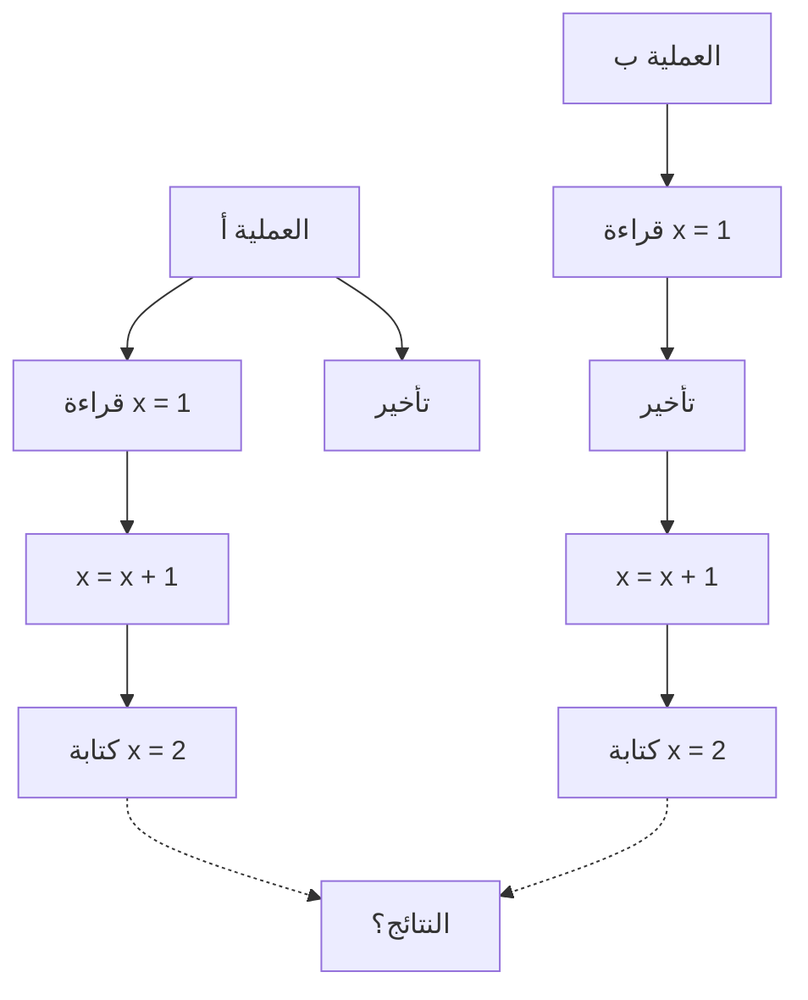

### أقفال البيانات الموزعة · Distributed Locks

#### قفل متutex الموزع

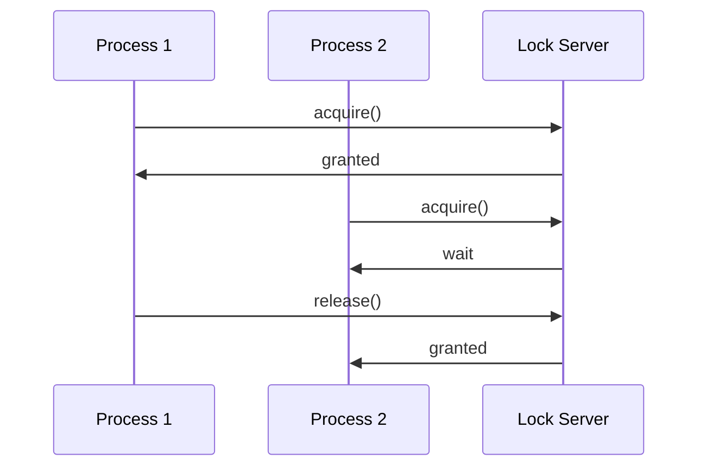

### خوارزميات التزامن · Synchronization Algorithms

#### خوارزمية Lamport

كل حدث له timestamp:

```python
# تحديث Counter
if process has event:
    counter[i] = counter[i] + 1
    
# إرسال رسالة
message.timestamp = counter[i]
counter[i] += 1
```

#### خوارزمية Ricart-Agrawala

1. طلب القفل من جميع العقد
2. انتظار الموافقة من الجميع
3. تنفيذ المنطقة الحرجة
4. إطلاق القفل

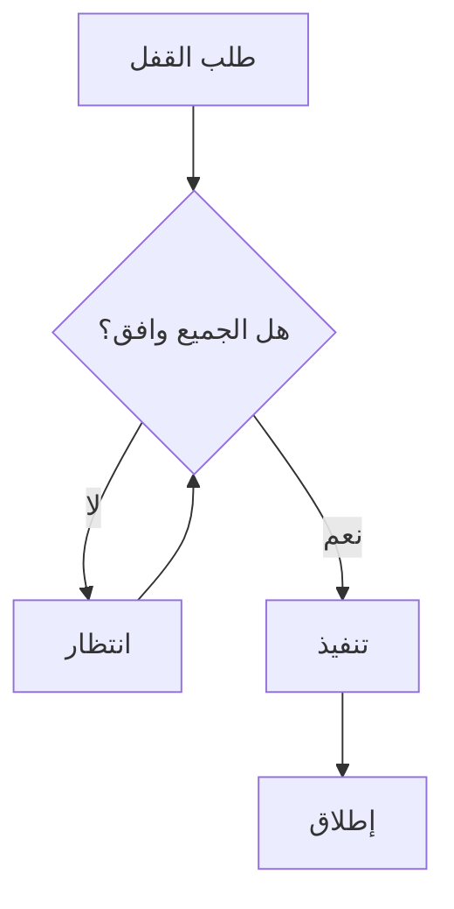

---

## 📁 الأنظمة الملفات الموزعة · Distributed File Systems

### مفهوم · Concept

نظام ملفات يتوزع على عدة حواسيب مع واجهة موحدة للمستخدم.

### بنية النظام · System Architecture

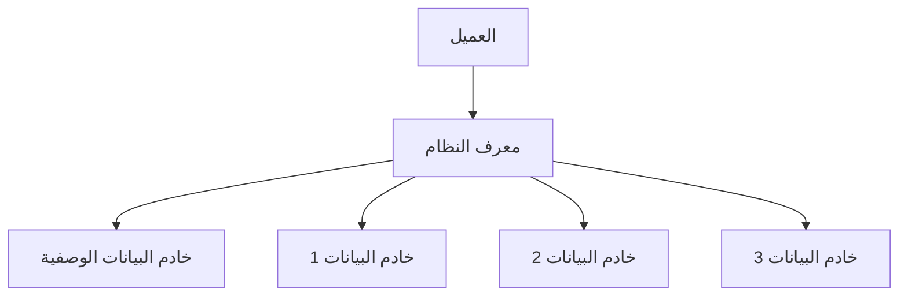

### خصائص NFS · NFS Characteristics

| الخاصية | الوصف |
|---------|-------|
| **الشفافية** | ظهور الملفات محلية |
| **التخزين المؤقت** | Cache على العميل |
| **Stateless** | بدون حالة |
| **UDP/TCP** | بروتوكولات الشبكة |

### بروتوكول NFS

```
mount(host, path, local_path)
read(fileid, offset, count)
write(fileid, offset, data)
create(name, mode)
remove(name)
```

### أنماط النسخ · Replication Patterns

| النمط | الوصف | المزايا | العيوب |
|-------|-------|---------|--------|
| **Primary-Backup** | نسخة واحدة أساسية | بسيط | فشل واحد = مشكلة |
| **Multi-Master** | عدة نسخ متساوية | توافر عالي | تعقيد التزامن |
| **Chain** | نسخ متسلسلة | توازن حمل | تأخير |

---

## ⚙️ التزامن في الأنظمة الموزعة · Concurrency Control

### معاملات موزعة · Distributed Transactions

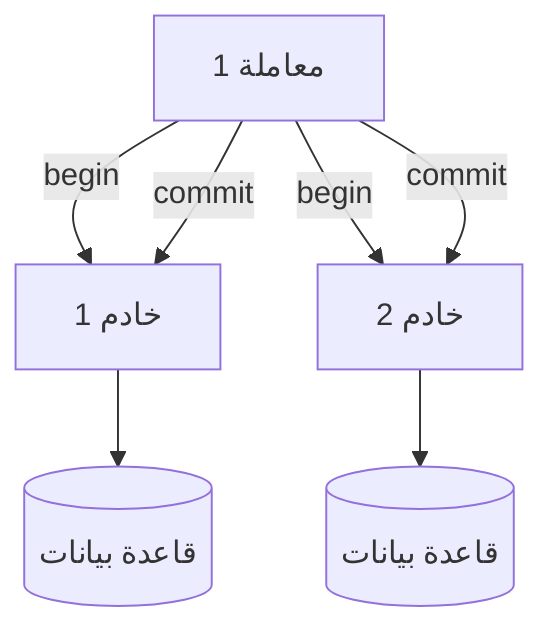

### نظرية CAP

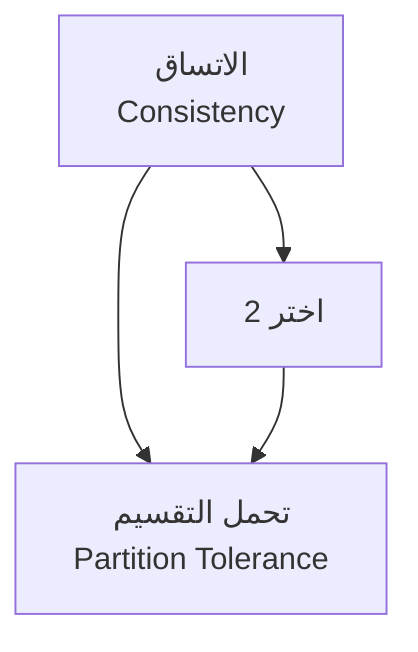

**ملاحظة**: في الأنظمة الموزعة،，我们必须 اختيار AP أو CP لأن الشبكة ستنقطع.

### بروتوكولات الالتزام · Commit Protocols

#### Two-Phase Commit (2PC)

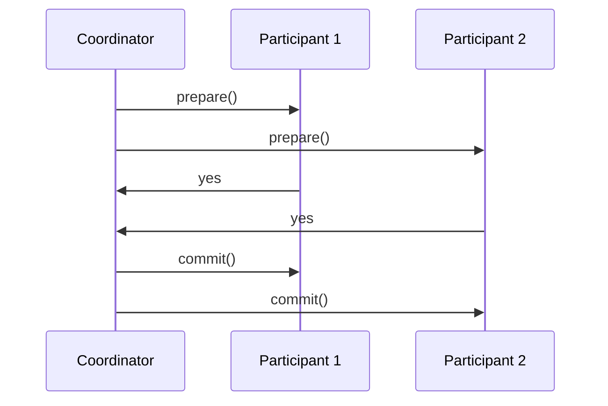

**ال步骤**:
1. **Prepare**:Coordinator يطلب vote من الجميع
2. **Commit**: إذا وافق الجميع، يوجه للالتزام

---

## 🌐 الاتصال بين العمليات · Inter-Process Communication

### نماذج الاتصال · Communication Models

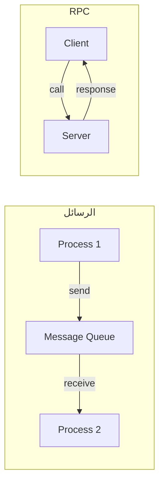

### RPC (Remote Procedure Call)

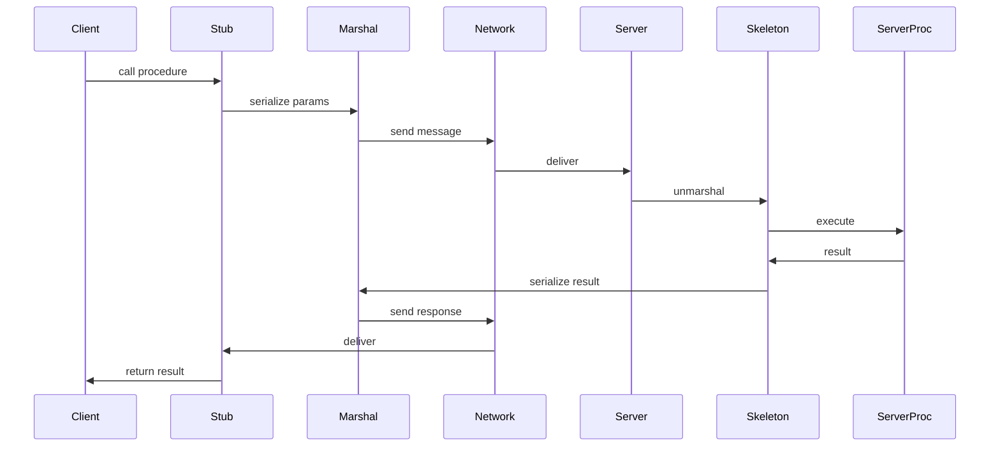

### صيغة البيانات · Data Formats

| التنسيق | الوصف | الاستخدام |
|---------|-------|-----------|
| **JSON** | نص قابل للقراءة | APIs |
| **XML** | علامات مت的结构ed | توزيع |
| **Protocol Buffers** | ثنائي compact | أداء عالي |
| **Apache Avro** | صف واحدschema | بيانات كبيرة |

---

## 🔄 التوازن بين الأحمال · Load Balancing

### استراتيجيات · Strategies

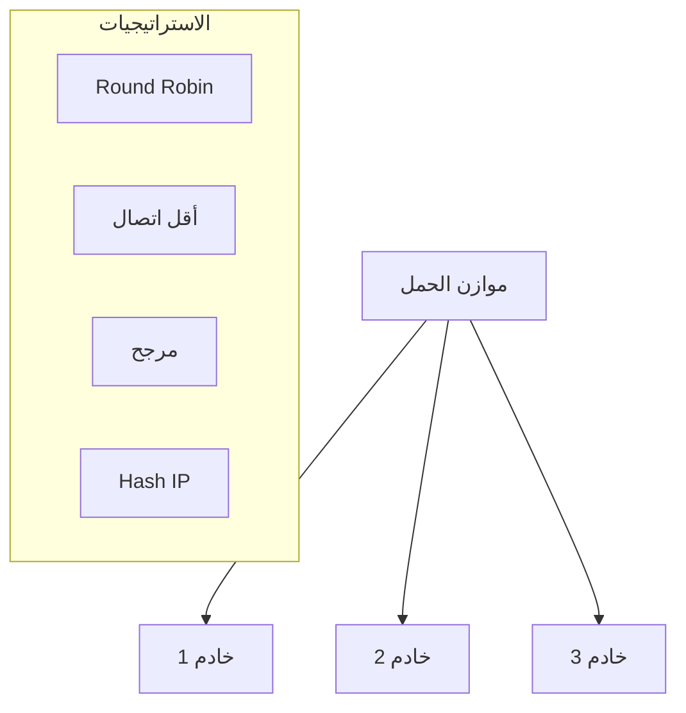

| الاستراتيجية | الوصف |
|--------------|-------|
| **Round Robin** | توزيع متساوي |
| **Least Connections** | أقل عدد اتصالات |
| **Weighted** | مرجح حسب القدرة |
| **IP Hash** | نفس العميل = نفس الخادم |

### خوارزميات التوازن · Algorithms

#### Least Connections

$$S_i = \frac{c_i}{\text{capacity}_i}$$

اختر الخادم ذو أقل $S_i$.

---

## 📊 جدول مرجعي شامل · Master Reference Table

### مقارنة نماذج الذاكرة · Memory Models Comparison

| النموذج | زمن الوصول | التعقيد | الاستخدام |
|---------|-------------|---------|-----------|
| **Shared Memory** | موحد | عالي | أنظمة متعددة المعالجات |
| **Distributed Memory** | غير موحد | متوسط | clusters |
| **NUMA** | متغير | عالي | خوادم كبيرة |

### بروتوكولات التزامن · Concurrency Protocols

| البروتوكول | الضمانات | الأداء |
|------------|----------|--------|
| **2PC** | Atomic | جيد |
| **3PC** | Atomic, Wait-free | متوسط |
| **Paxos** | Consensus | جيد |
| **Raft** | Consensus | جيد |

### أنظمة الملفات الموزعة · Distributed File Systems

| النظام | المميزات | الاستخدام |
|--------|---------|-----------|
| **NFS** | بسيط، واسع | Linux/Unix |
| **AFS** | Cache كبير | أكاديمي |
| **Coda** | قطع التيار | محمول |
| **HDFS** | MapReduce | Hadoop |

---

## ⚠️ أخطاء شائعة وملاحظات · Common Pitfalls & Notes

### ❌ أخطاء شائعة

1. **مشاكل التزامن**:
   - Race conditions في العمليات الموزعة
   - Deadlocks في الموارد المشتركة

2. **مشاكل الشبكة**:
   - انقطاع الشبكة → انقسام النظام
   - latency عالي → أداء منخفض

3. **مشاكل الاتساق**:
   - بيانات غير متسقة بين النسخ
   - عدم تحديث الـ Cache

4. **مشاكل الأمان**:
   - اعتراض البيانات في الشبكة
   - وصول غير مصرح

### 💡 نصائح مهمة

- **الشبكة**: حجر الأساس، اختر topology مناسب
- **التخزين المؤقت**: مفيد لكن يحب التحديث
- **التعافي**: خطط للأخطاء والفشل
- **التوسع**: صمم للتوسع الأفقي

### 📌 ملاحظات نهائية

- **CAP Theorem**: لا يمكنك الحصول على الاتساق والتوفر والتجزئة معاً
- **FLP Impossibility**: لا يوجد خوارزمية确定性 للتوافق في نظام asynchronous مع faults
- **PACELC**: إذا انقسم النظام → اختر Availability أو Consistency، وإلا → اختر Latency أو Consistency

---

## 📝 أمثلة محلولة · Worked Examples

### مثال 1: خوارزمية Lamport timestamps

**المعطيات:**
- Process A يرسل رسالة لـ Process B
- Process B يرسل رسالة لـ Process C
- Process A يرسل أخرى لـ Process C

**الحل:**

| الحدث | Process A | Process B | Process C |
|-------|-----------|-----------|-----------|
| m1: A→B | 1 | - | - |
| receive m1 | 1 | 2 | - |
| m2: B→C | 2 | 3 | - |
| receive m2 | 2 | 3 | 4 |
| m3: A→C | 3 | 3 | - |
| receive m3 | 3 | 3 | 5 |

### مثال 2: Two-Phase Commit

**السيناريو:**
- Coordinator يطلب commit من 3 participants
- 2 يوافقون، 1 يرفض

**النتيجة:**
- abort للجميع
- Participants تحذف التغييرات

### مثال 3: حساب تكلفة NFS

**المعطيات:**
- قراءة ملف 4KB
- Cache miss
- زمن الشبكة: 5ms
- زمن القرص: 10ms

**الحل:**
- زمن القراءة = زمن الشبكة + زمن القرص = 5 + 10 = 15ms
- Cache hit = 0.1ms فقط

---

(End of file)