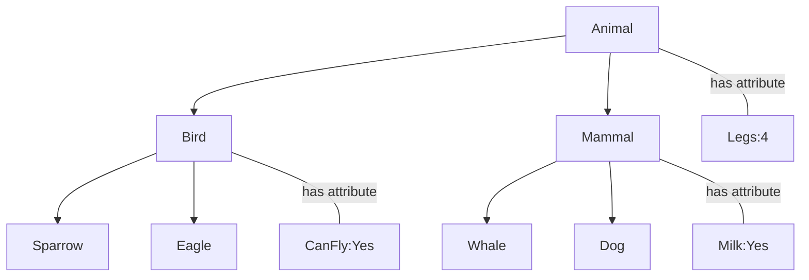
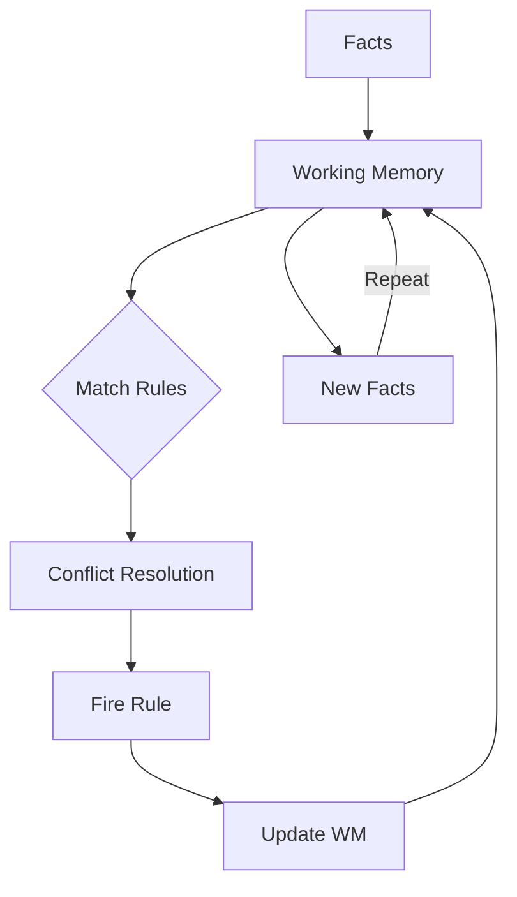
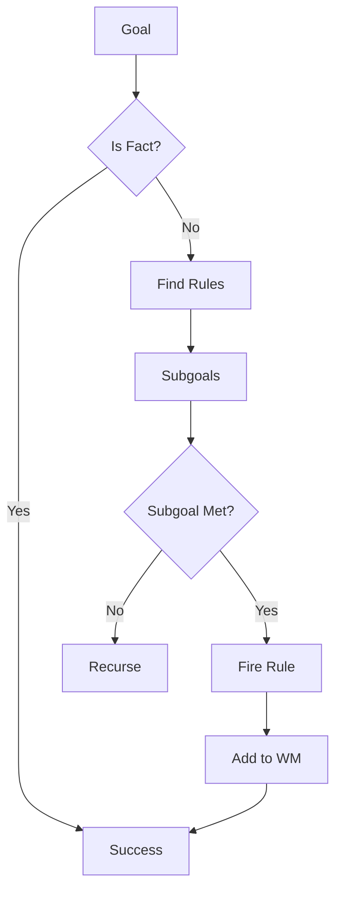
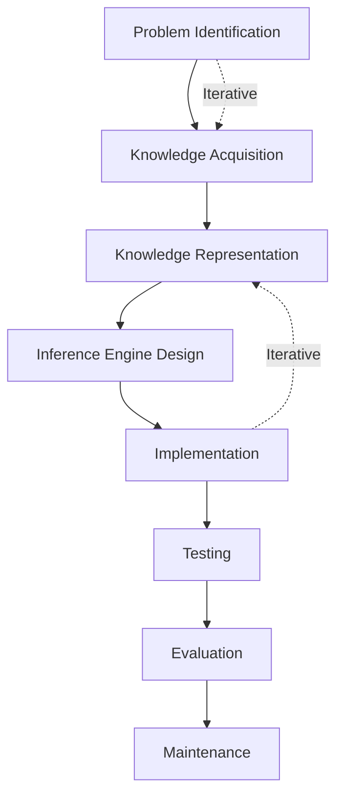
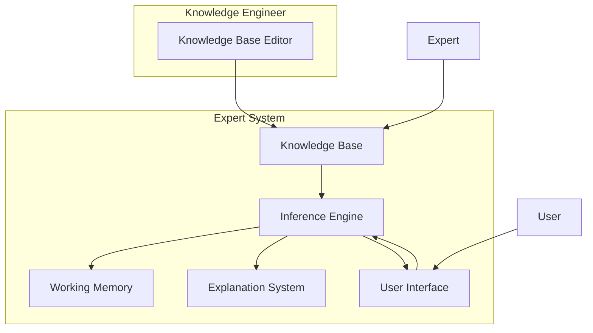
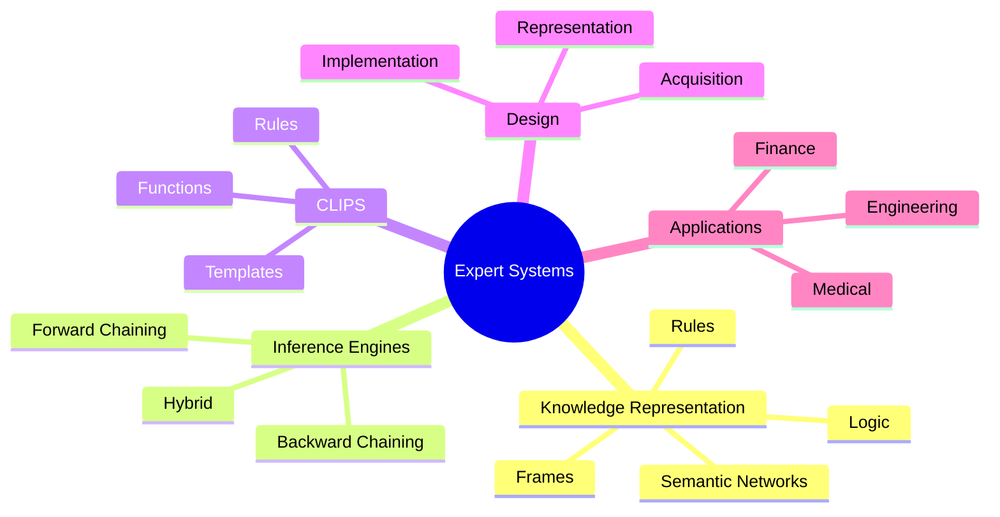

# نظم خبرة (Expert Systems)

## نظرة عامة (Overview)

```
┌─────────────────────────────────────────────────────────────┐
│               Expert Systems                      │
├─────────────────────────────────────────────────────┤
│  Knowledge → Inference → CLIPS → Design          │
└─────────────────────────────────────────────────────┘
```

---

## 1. представление المعرفة (Knowledge Representation)

### أنواع المعرفة

| النوع | الوصف | مثال |
|-------|-------|-----|
| Declarative | بيانات | facts |
| Procedural | إجراءات | rules |
| Heuristic |经验的 | heuristics |
| Meta-knowledge | معرفة حول المعرفة | rules about rules |

### منطق القضايا (Propositional Logic)

```mermaid
graph TD
    A[Proposition] --> B[Atomic]
    A --> C[Compound]
    
    B -->|p| D[True/False]
    
    C --> E[NOT (¬)]
    C --> F[AND (∧)]
    C --> G[OR (∨)]
    C --> H[IMPLIES (→)]
    C --> I[IFF (↔)]
    
    E --> J[Negation]
    F --> K[Conjunction]
    G --> L[Disjunction]
    H --> M[Implication]
    I --> N[Biconditional]
```

### First-Order Logic

```prolog
% Facts
father(john, mary).
father(john, tom).
mother(susan, mary).

% Rules
parent(X, Y) :- father(X, Y).
parent(X, Y) :- mother(X, Y).

grandparent(X, Z) :- parent(X, Y), parent(Y, Z).

sibling(X, Y) :- 
    parent(P, X),
    parent(P, Y),
    X \= Y.
```

### Frames

```python
# Frame Representation
class Frame:
    def __init__(self, name, slots):
        self.name = name
        self.slots = slots

# Example Frame
person = Frame("Person", {
    "name": "John",
    "age": 30,
    "occupation": "Engineer",
    "is_a": ["Human", "Adult"]
})
```

### Semantic Networks



---

## 2. محركات الاستدلال (Inference Engines)

### أنواع الاستدلال

| النوع | الوصف | الاتجاه |
|-------|-------|----------|
| Forward Chaining | أمامي | البيانات → الهدف |
| Backward Chaining | خلفي | الهدف → البيانات |
| Bidirectional | ثنائي الإتجاه | كلا الاتجاهين |

### Forward Chaining



```python
# Forward Chaining Algorithm
def forward_chaining(facts, rules):
    working_memory = set(facts)
    agenda = []
    
    for rule in rules:
        if rule.matches(working_memory):
            agenda.append(rule)
    
    while agenda:
        rule = conflict_resolution(agenda)
        new_facts = rule.fire()
        working_memory.update(new_facts)
        agenda = update_agenda(agenda, rules, working_memory)
    
    return working_memory
```

### Backward Chaining



```python
# Backward Chaining Algorithm
def backward_chaining(goal, rules):
    if is_fact(goal):
        return True
    
    for rule in rules:
        if rule.concludes(goal):
            for premise in rule.premises:
                if not backward_chaining(premise, rules):
                    break
            else:
                rule.fire()
                return True
    
    return False
```

### Conflict Resolution

| الاستراتيجية | الوصف |
|-----------|-------|
| Specificity | الأكثر تحديداً |
| Recency | الأخيرة |
| Priority | الأقدم |
| Random | عشوائي |

---

## 3. CLIPS

### مقدمة CLIPS

```clips
;===========================================
;                CLIPS Rules
;===========================================

; Define template
(deftemplate symptom
   (multislot name)
   (multislot severity))

; Define facts
(deffacts initial-facts
   (symptom name fever severity moderate)
   (symptom name cough severity mild))

; Define rules
(defrule diagnose-flu
   (symptom name fever)
   (symptom name cough)
   =>
   (assert (diagnosis flu)))
```

### CLIPS Structures

| الهيكل | الوظيفة |
|--------|----------|
| deftemplate | قالب |
| deffacts | حقائق ابتدائية |
| defrule | قاعدة |
| defglobal | متغيرات عامة |
| deffunction | دالة |
| defclass | فئة |

### CLIPS Example: Medical Diagnosis

```clips
; Define disease templates
(deftemplate disease
   (multislot name)
   (multislot symptoms))

(deftemplate patient
   (multislot symptoms))

; Define diseases
(deffacts diseases
   (disease name flu symptoms fever|cough|fatigue)
   (disease name cold symptoms runny_nose|sore_throat)
   (disease name allergy symptoms sneezing|itchy_eyes))

; Check symptoms rule
(defrule check-symptoms
   (patient (symptoms $?s))
   (disease (name ?d) (symptoms $?syms))
   (test (subsetp $?syms $?s))
   =>
   (printout t "Possible disease: " ?d crlf))
```

### Functions in CLIPS

```clips
; Custom function
(deffunction calculate-severity (?f ?c)
   (bind ?score (+ (* ?f 2) (* ?c 3)))
   (return ?score))

; Math operations
(printout t "Score = " (calculate-severity 5 10) crlf)

; String operations
(str-cat "Patient: " (str-eval name) crlf)
(sub-string 1 5 "Welcome")

; List operations
(bind ?list (create$ a b c d e))
(nth$ 3 ?list)
(length$ ?list)
(member$ b ?list)
```

---

## 4. تصميم نظم الخبرة (Expert System Design)

### etapas التصميم



### هيكل النظام



### Knowledge Acquisition

| الطريقة | الوصف |
|--------|-------|
| Interview | مقابلة الخبراء |
| Observation | ملاحظة |
| Protocol Analysis | بروتوكول |
| Repertory Grid | شبكة |

---

## 5. قاعدة المعرفة (Knowledge Base)

### بناء القاعدة

```python
# Rule-Based Knowledge Base
class Rule:
    def __init__(self, name, conditions, conclusion):
        self.name = name
        self.conditions = conditions
        self.conclusion = conclusion
    
    def matches(self, facts):
        return all(fact in facts for fact in self.conditions)

class KnowledgeBase:
    def __init__(self):
        self.rules = []
        self.facts = set()
    
    def add_rule(self, rule):
        self.rules.append(rule)
    
    def add_fact(self, fact):
        self.facts.add(fact)
    
    def infer(self):
        new_facts = set()
        for rule in self.rules:
            if rule.matches(self.facts):
                new_facts.add(rule.conclusion)
        self.facts.update(new_facts)
        return new_facts
```

### Examples reglas

```clips
; Water detection system
(defrule water-level-low
   (sensor reading < 20)
   (pump status on)
   =>
   (assert (alarm "Water level low"))
   (printout t "ALARM: Water level low" crlf))

(defrule valve-control
   (tank level > 80)
   =>
   (assert (valve close))
   (printout t "Closing valve" crlf))
```

---

## 6. Explanation System

### أنواع التفسيرات

| النوع | الوصف |
|-------|-------|
| How | كيف تم استنتاج ذلك؟ |
| Why | لماذا你需要 هذا؟ |
| What | ماذا لو غيرنا؟ |
| Trace | تتبع الاستدلال |

### Implementation

```python
class ExplanationSystem:
    def __init__(self):
        self.explanation_log = []
    
    def log_inference(self, rule, facts):
        self.explanation_log.append({
            'rule': rule.name,
            'facts': facts,
            'conclusion': rule.conclusion
        })
    
    def how(self, fact):
        for entry in self.explanation_log:
            if entry['conclusion'] == fact:
                return f"Fact {fact} was inferred by {entry['rule']}"
        return "Unknown"
    
    def why(self, question):
        return f"This question is needed to determine {question}"
    
    def trace(self):
        return self.explanation_log
```

---

## 7. جدول المقارنات (Comparison Tables)

### أنماط التمثيل

| النمط | المزايا | العيوب |
|-------|---------|--------|
| Rules | مرن, واضح | قد يكون بطيء |
| Frames | هيكلي, موروث | معقد |
| Semantic Networks | حدسي, مرئي | غير دقيق |
| Logic | رسمي, متسق | صعب الصياغة |
| Neural Networks | تعلمي | black box |

### محركات الاستدلال

| النوع | الاستخدام |
|-------|-------------|
| Forward Chaining | Diagnostic, Monitoring |
| Backward Chaining | Troubleshooting, Planning |
| Hybrid | Complex Systems |

---

## 8. التطبيقات (Applications)

### مجالات التطبيق

| المجال | التطبيق |
|--------|----------|
| Medical | التشخيص الطبي |
| Engineering | التصميم والهندسة |
| Finance | التحليل المالي |
| Geology | استكشاف المعادن |
| Agriculture | إدارة المزارع |

### Medical Expert System

```clips
; Medical diagnosis system
(defrule diagnose-viral-infection
   (symptom fever)
   (symptom muscle_ache)
   (symptom fatigue)
   (duration > 3)
   =>
   (assert (diagnosis viral_infection))
   (printout t "Possible: Viral Infection" crlf))

(defrule prescribe-treatment
   (diagnosis viral_infection)
   (patient age > 18)
   =>
   (assert (treatment rest))
   (assert (treatment fluids))
   (assert (treatment acetaminophen)))
```

---

## 9. المشاكل الشائعة (Common Pitfalls)

### ⚠️ ال��شا��ل

```warning
❌ قاعدة معرفة غير كاملة
❌ قواعد متعارضة
❌ دوران (Infinite Loop)
❌ عدم وجود تفسير
❌ صعوبة الصيانة
❌ عدم التعامل مع عدم اليقين
❌ اخذاذات في اكتساب المعرفة
```

### ✅ Solutions

```python
# ✅ Conflict detection
def detect_conflicts(rules):
    for r1 in rules:
        for r2 in rules:
            if r1.conclusion != r2.conclusion:
                if all(c in r2.conditions for c in r1.conditions):
                    print(f"Conflict: {r1.name} vs {r2.name}")

# ✅ Cyclic dependency detection
def detect_cycles(rules):
    # Use DFS to detect cycles
    graph = build_dependency_graph(rules)
    visited = set()
    for node in graph:
        if node not in visited:
            if dfs_has_cycle(node, visited, graph):
                return True
    return False
```

---

## 10. الأوامر السريعة (Quick Commands)

```bash
# CLIPS commands
(load "filename.clp")
(unwatch all)
(watch rules)
(reset)
(run)
(facts)
(rules)
(agenda)
(list-defrules)
(list-deftemplates)
```

---

## 11. ملخص (Summary)



**Key Points:**
- 🧠 **Knowledge**: representación المعرفة
- 🔄 **Inference**: الاستدلال
- 💻 **CLIPS**: لغة البرمجة
- 🏗️ **Design**: التصميم
- 📋 **Applications**: التطبيقات