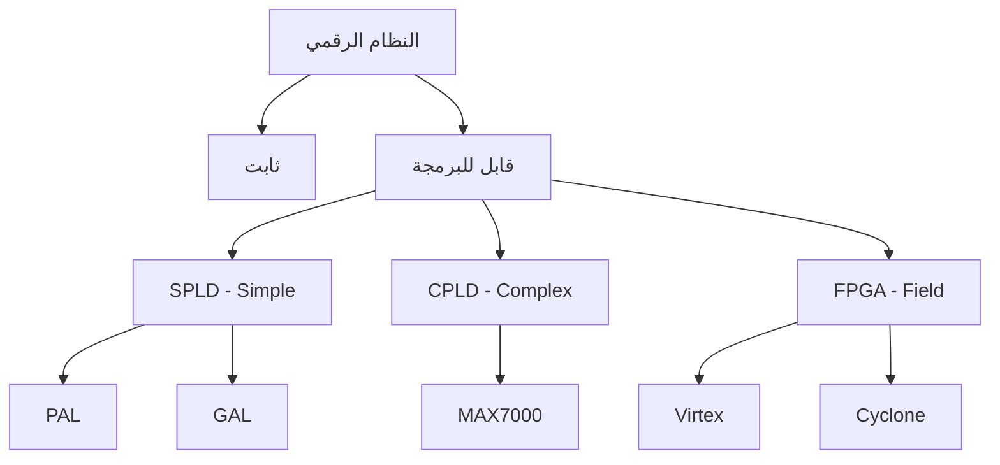
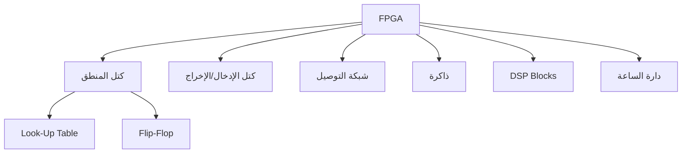
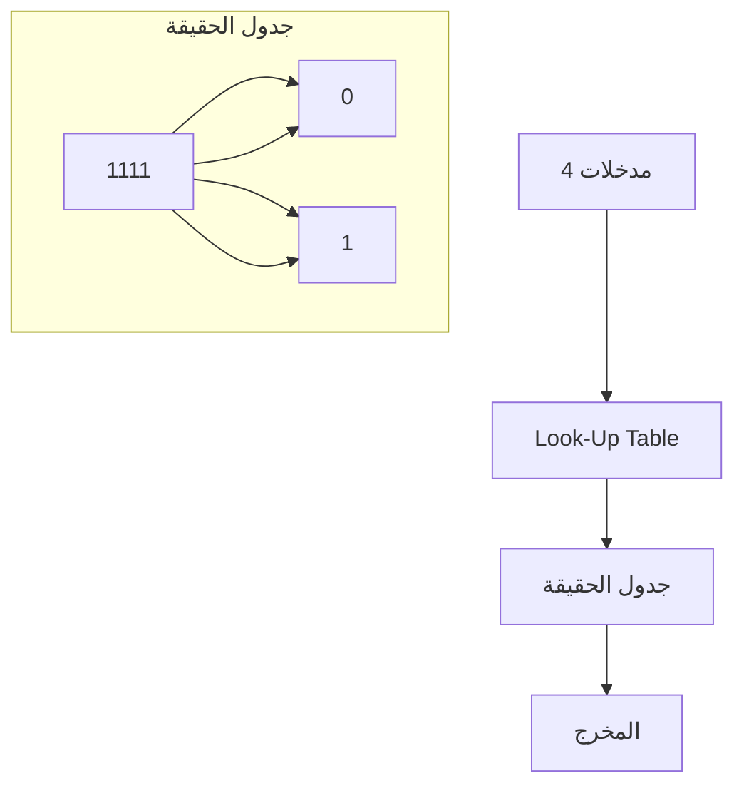
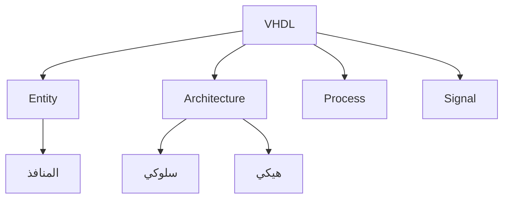
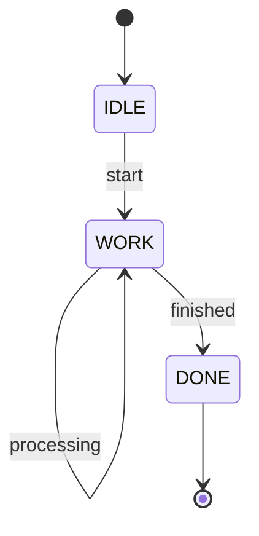
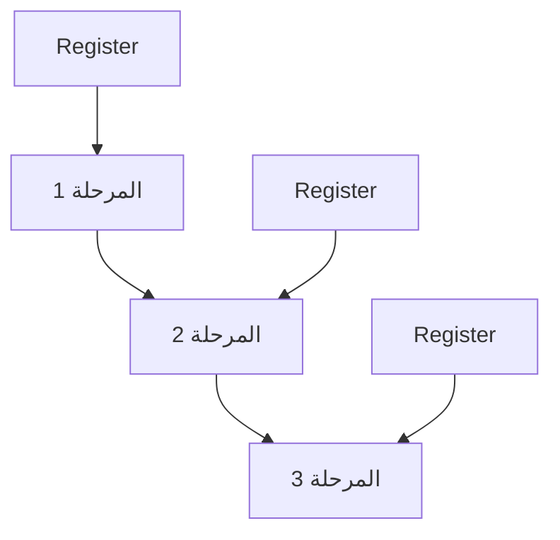
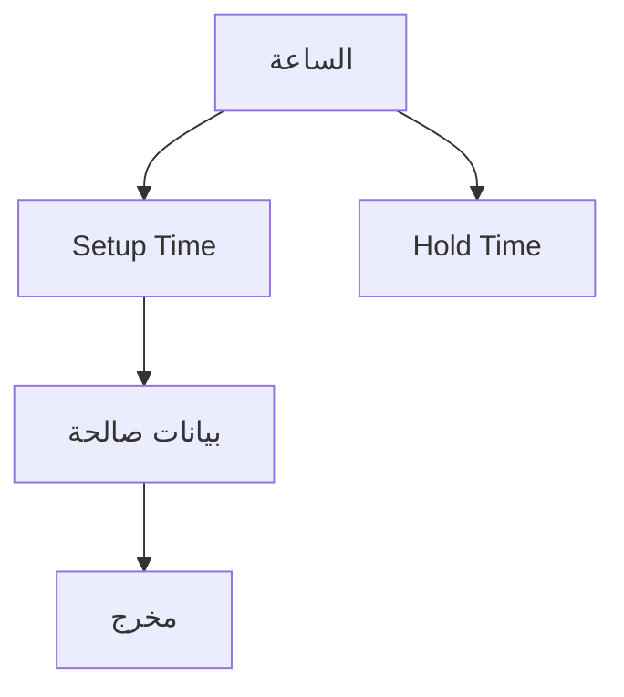
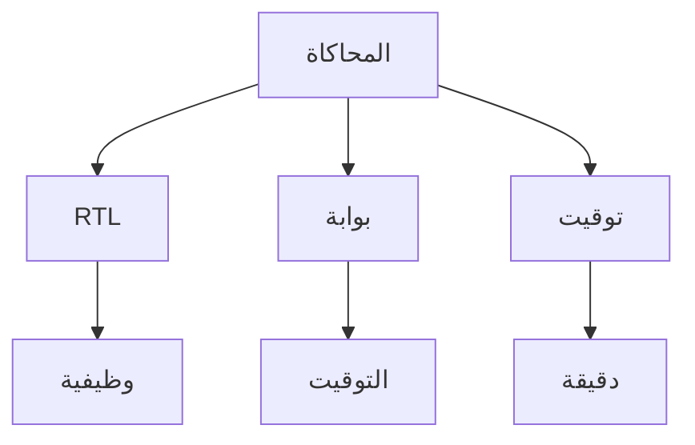

# نظم رقمية مبرمجة · Programmable Digital Systems (Year 4 - Semester 2)

## 🔧 مقدمة في الأنظمة الرقمية المبرمجة · Introduction

### مفهوم النظام الرقمي المبرمج

- **النظام الرقمي المبرمج** (Programmable Digital System): دوائر رقمية قابلة للبرمجة والتعديل.
- **PLD**: Device قابل للبرمجة منطقياً.



### مقارنة الأنواع

| النوع | البوابات | استخدام الذاكرة | التطبيقات |
|-------|----------|----------------|-----------|
| **PAL** | 10-20 | لا | منطق بسيط |
| **GAL** | 10-20 | قابل لإعادة | prototype |
| **CPLD** | 100-1000 | EEPROM | controllers |
| **FPGA** | 10000+ | SRAM/Flash | معالجات، DSP |

---

## 🎯 FPGA - Field Programmable Gate Array

### بنية FPGA



### المكونات الرئيسية

| المكون | الوصف | الوظيفة |
|--------|-------|---------|
| **CLB** | Configuration Logic Block | تنفيذ المنطق |
| **LUT** | Look-Up Table | جدول الحقيقة |
| **FF** | Flip-Flop | تخزين حالة |
| **IOB** | Input/Output Block | التواصل مع الخارج |
| **BRAM** | Block RAM | ذاكرة مدمجة |

### بنية LUT



### أنواع FPGA

| العائلة | الشركة | التقنية | الاستخدام |
|---------|--------|---------|-----------|
| **Virtex** | Xilinx | SRAM | عالي الأداء |
| **Cyclone** | Intel/Altera | Flash | منخفض التكلفة |
| **Artix** | AMD/Xilinx | Flash | متوسط |
| **Lattice** | Lattice | Flash | منخفض الطاقة |

---

## 📝 VHDL - VHSIC Hardware Description Language

### مفهوم VHDL

- **VHDL**: لغة وصف العتاد الفائقة السرعة.
- **الهدف**: تصميم ووصف الدوائر الرقمية.



### الهيكل الأساسي

```vhdl
-- مكتبة
library IEEE;
use IEEE.STD_LOGIC_1164.ALL;

-- الكيان (الواجهة)
entity my_entity is
    Port (
        a : in std_logic;
        b : in std_logic;
        y : out std_logic
    );
end my_entity;

-- البنية (التنفيذ)
architecture Behavioral of my_entity is
begin
    y <= a and b;
end Behavioral;
```

### الأنواع البيانات · Data Types

| النوع | الوصف | القيم |
|-------|-------|-------|
| **std_logic** | منطق واحد | '0', '1', 'Z', 'X' |
| **std_logic_vector** | متجه منطقي | "0101" |
| **integer** | عدد صحيح | -2147483648... |
| **bit** | بت | '0', '1' |
| **boolean** | منطقي | true, false |

### العمليات · Operators

| النوع | العملية | المؤثر |
|-------|--------|--------|
| **منطقية** | AND, OR, NOT | and, or, not |
| **حسابية** | جمع، ضرب | +, -, * |
| **مقارنة** | مساواة، أكبر | =, <, > |
| **إزاحة** | تحول | sll, srl |

---

## 🔄 العمليات الشرطية · Conditional Operations

### if-else

```vhdl
process(a, b)
begin
    if a = '1' then
        y <= b;
    else
        y <= '0';
    end if;
end process;
```

### case

```vhdl
process(sel)
begin
    case sel is
        when "00" => y <= "0000";
        when "01" => y <= "0001";
        when "10" => y <= "0010";
        when others => y <= "1111";
    end case;
end process;
```

### when-else

```vhdl
y <= a when sel = "00" else
    b when sel = "01" else
    "0000";
```

---

## 🔃 آلات الحالة · State Machines

### مفهوم آلة الحالة

- **آلة الحالة المحدودة** (FSM): نموذج رياضي لوصف سلوك النظام.



### FSM في VHDL

```vhdl
type state_type is (IDLE, WORK, DONE);
signal state : state_type;

process(clk)
begin
    if rising_edge(clk) then
        case state is
            when IDLE =>
                if start = '1' then
                    state <= WORK;
                end if;
            when WORK =>
                if finished = '1' then
                    state <= DONE;
                end if;
            when DONE =>
                state <= IDLE;
        end case;
    end if;
end process;
```

### أنواع FSM

| النوع | الوصف | المزايا |
|-------|-------|-----------|
| **Mealy** | المخرج يعتمد على المدخل والحالة | مرونة |
| **Moore** | المخرج يعتمد على الحالة فقط | بسيط |

---

## 🏗️ البنية الهيكلية · Structural Design

### المكونات · Components

```vhdl
-- تعريف المكون
component and_gate is
    Port (
        a : in std_logic;
        b : in std_logic;
        y : out std_logic
    );
end component;

-- استخدام المكون
begin
    U1: and_gate port map (a => a, b => b, y => tmp);
```

###التوصيل · Instantiation

```vhdl
-- بوابات أساسية
U1: and2 port map (a => in1, b => in2, y => out1);
U2: or2 port map (a => out1, b => in3, y => out2);
U3: not1 port map (a => out2, y => final);
```

### Pipeline



---

## ⏱️ التوقيت والدورات · Timing & Cycles

### مفهوم التوقيت

- **التأخير propagation** (Propagation Delay): زمن انتقال الإشارة.
- **التردد الأقصى** (Max Frequency): $f_{max} = 1 / T_{min}$.



### المشاكل

| المشكلة | الوصف | الحل |
|---------|-------|------|
| **Metastability** | حالة غير مستقرة | سجلات |
| **Clock Skew** | اختلاف وقت الساعة | تزامن |
| **Glitch** | تغييرات غير مرغوبة | تعتيب |

### Pipeline

$$Throughput = \frac{1}{Stage Delay}$$

$$Latency = N \times Stage Delay$$

---

## 🧪 المحاكاة · Simulation

### مستويات المحاكاة



### المحاكاة الوظيفية

```vhdl
-- اختبار
process
begin
    a <= '0';
    b <= '0';
    wait for 10 ns;
    
    a <= '1';
    b <= '0';
    wait for 10 ns;
    
    a <= '1';
    b <= '1';
    wait for 10 ns;
    
    wait;
end process;
```

---

## 📊 جدول مرجعي شامل · Master Reference Table

### أوامر VHDL الأساسية

| الأمر | الوصف |
|-------|-------|
| `entity` | تعريف الواجهة |
| `architecture` | تعريف البنية |
| `port` | تعريف المنافذ |
| `signal` | تعريف الإشارات |
| `process` | تعريف عملية |
| `component` | تعريف مكون |
| `generic` | معاملات عامة |

### بنية FPGA

| المكون | الوظيفة |
|--------|--------|
| **LUT** | تنفيذ المنطق |
| **FF** | تخزين الحالة |
| **MUX** | اختيار المدخلات |
| **Carry Chain** | الحساب |
| **BRAM** | الذاكرة |

### أنواع التوصيل

| النوع | الوصف |
|-------|-------|
| **port map** | توصيل المكونات |
| **generate** | تكرار هيكلي |
| **for generate** | تكرار بعدد |
| **if generate** | تكرار شرطي |

---

## ⚠️ أخطاء شائعة وملاحظات · Common Pitfalls & Notes

### ❌ أخطاء شائعة

1. **توقيت**:
   -忽视 Setup/Hold Time
   -عدم حساب التأخير

2. **VHDL**:
   -عدم تعريف النوع
   -خطأ في التوصيل

3. **التوصيل**:
   -دارات متزامنة بشكل خاطئ
   -عدم استخدام Pipeline

4. **المحاكاة**:
   -عدم اختبار الحالات الحدية
   -عدم محاكاة التوقيت

### 💡 نصائح مهمة

- **Clock Domain**: انتبه لاختلاف نطاقات الساعة
- **Reset**: استخدم reset متزامن/غير متزامن
- **Enable**: استخدم enable للتحكم
- **Coding Style**: اتبع معايير الكتابة

### 📌 ملاحظات نهائية

- **RTL**: Register-Transfer Level
- **Latency**: زمن الدخول والخروج
- **Throughput**: عدد العمليات/وحدة الزمن
- **Resource Usage**: استخدام الموارد

---

## 📝 أمثلة محلولة · Worked Examples

### مثال 1: Full Adder

```vhdl
entity full_adder is
    Port (
        a, b, cin : in std_logic;
        sum, cout : out std_logic
    );
end full_adder;

architecture Behavioral of full_adder is
begin
    sum <= a xor b xor cin;
    cout <= (a and b) or (cin and (a xor b));
end Behavioral;
```

### مثال 2: mux 4-to-1

```vhdl
process(sel, a, b, c, d)
begin
    case sel is
        when "00" => y <= a;
        when "01" => y <= b;
        when "10" => y <= c;
        when others => y <= d;
    end case;
end process;
```

### مثال 3: عداد تصاعدي

```vhdl
process(clk, rst)
begin
    if rst = '1' then
        cnt <= (others => '0');
    elsif rising_edge(clk) then
        if enable = '1' then
            cnt <= cnt + 1;
        end if;
    end if;
end process;
```

---

(End of file)