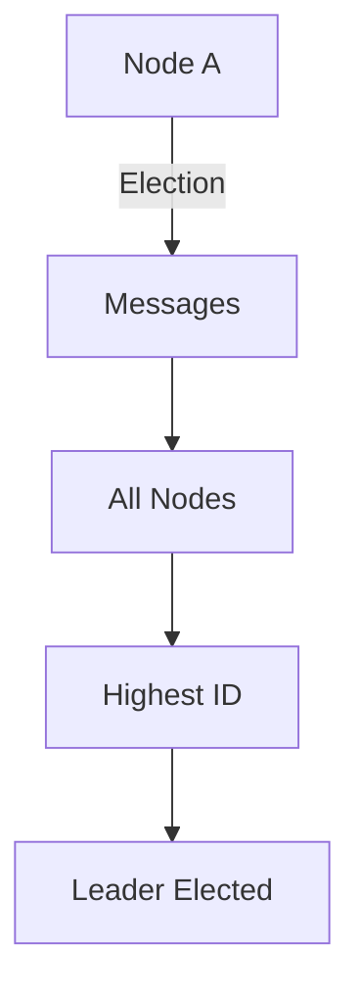
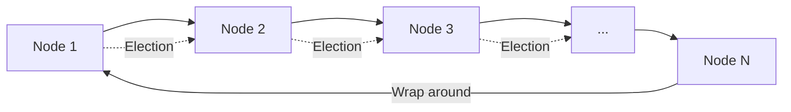
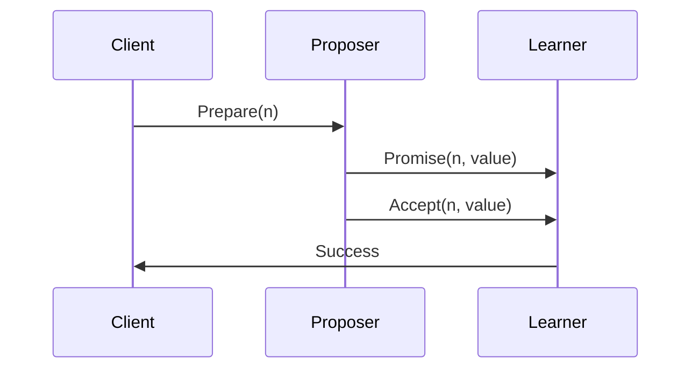
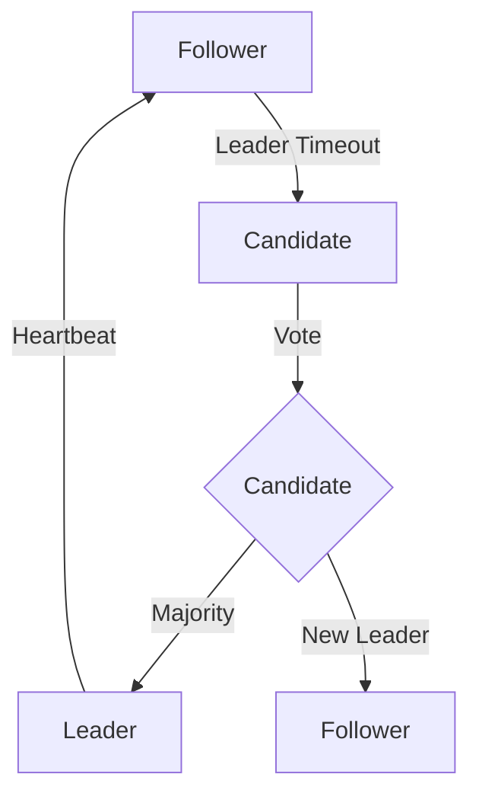
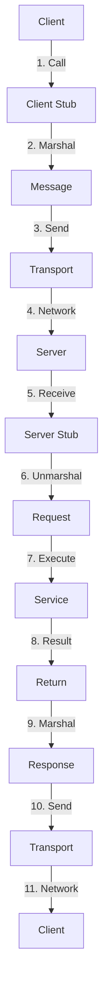
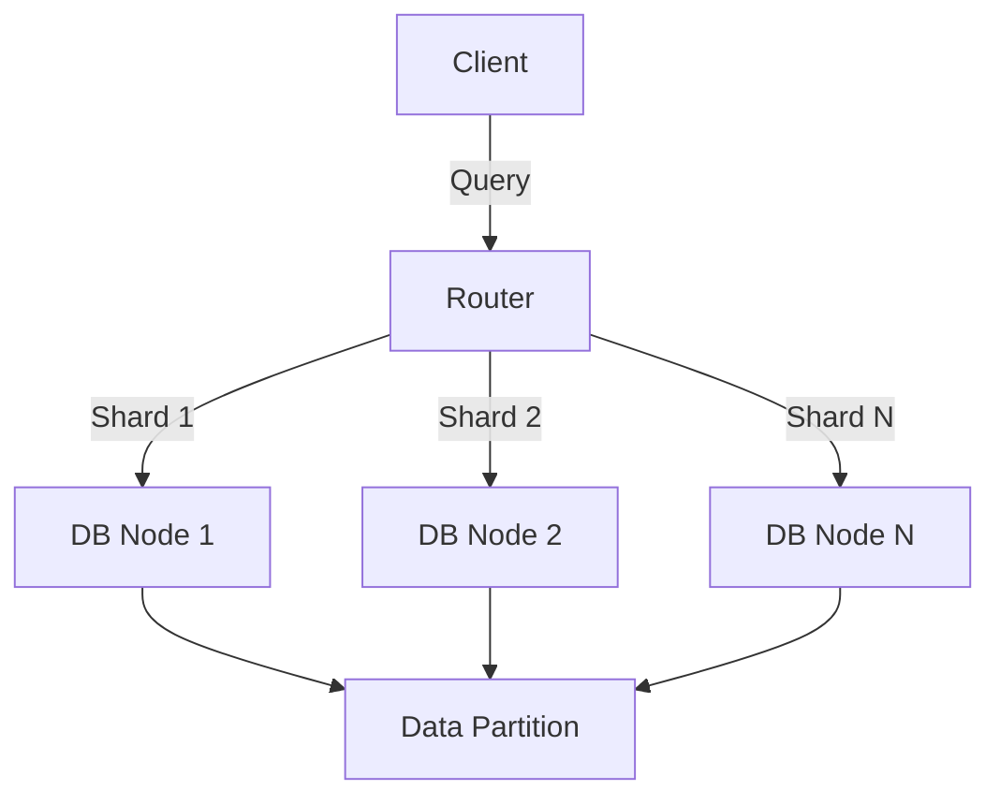
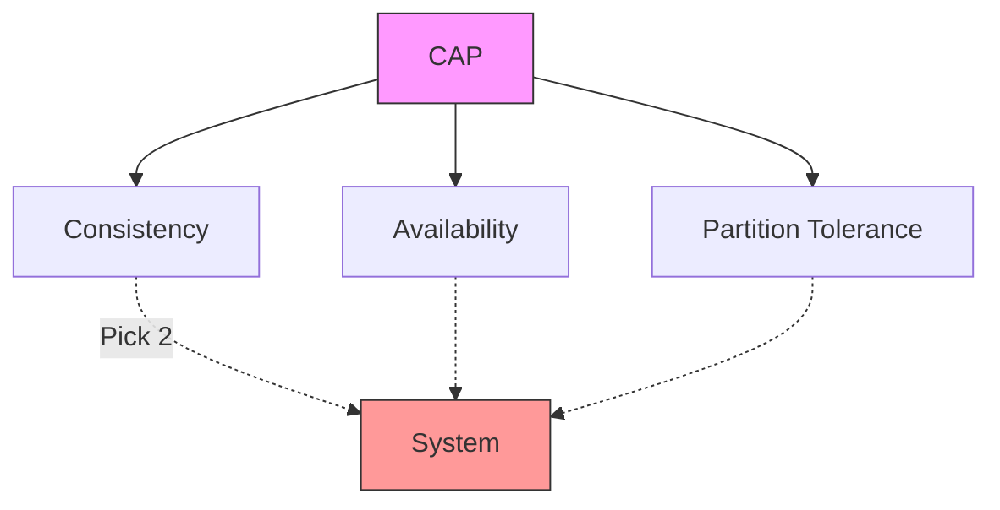
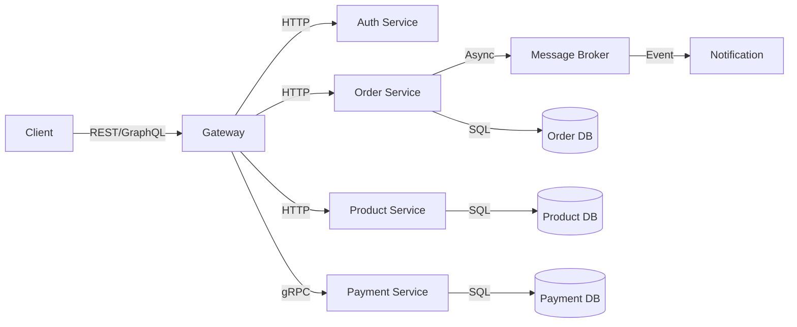
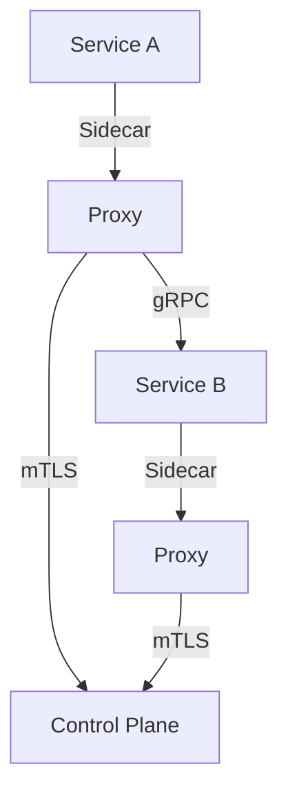
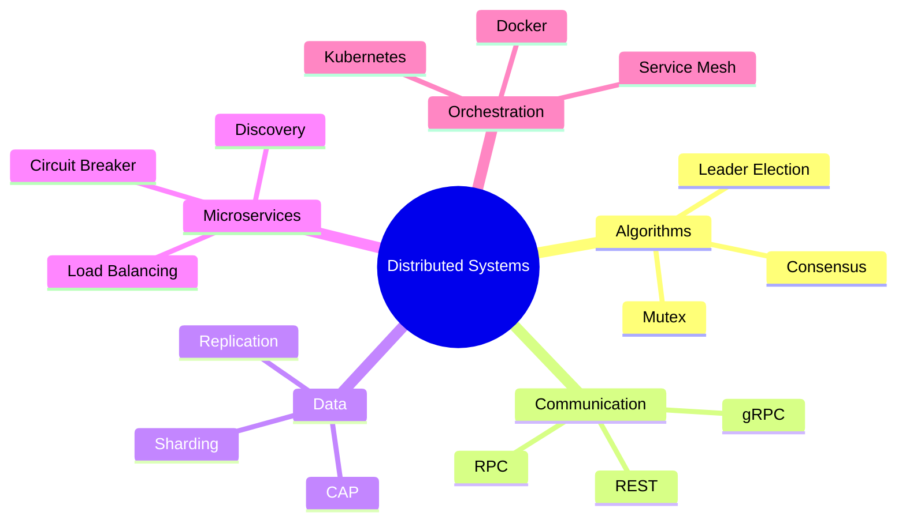

# نظم موزعة (Distributed Systems)

## نظرة عامة (Overview)

```
┌─────────────────────────────────────────────────────────────┐
│             Distributed Systems                  │
├─────────────────────────────────────────────────────┤
│  Algorithms → Consensus → RPC → Databases → Microservices  │
└─────────────────────────────────────────────────────┘
```

---

## 1. خوارزميات موزعة (Distributed Algorithms)

### أنواع الخوارزميات

| النوع | الوصف | الاستخدام |
|-------|-------|-----------|
| Leader Election | انتخاب القائد | التنسيق |
| Mutex | الاستبعاد المتبادل | الموارد |
| Consensus | الإجماع | الن decision-making |
| Replication | النسخ | التوافر |

### خوارزمية انتخاب القائد



### Bully Algorithm

```python
# Bully Algorithm Implementation
class BullyElection:
    def __init__(self, node_id, all_nodes):
        self.node_id = node_id
        self.all_nodes = all_nodes
        self.is_coordinator = False
    
    def start_election(self, higher_nodes):
        if not higher_nodes:
            self.become_coordinator()
        else:
            self.send_election(higher_nodes)
    
    def send_election(self, nodes):
        for node in nodes:
            send_message(node, 'ELECTION')
    
    def become_coordinator(self):
        self.is_coordinator = True
        for node in self.all_nodes:
            if node != self.node_id:
                send_message(node, 'COORDINATOR')
```

### Ring Algorithm



---

## 2. الإجماع (Consensus)

### Paxos



### phases

| الطور | الوصف |
|------|-------|
| Prepare | prepare(nid) |
| Promise | promise(nid, value) |
| Accept | accept(nid, value) |
| Learn | learn(nid, value) |

```python
# Simplified Paxos
class PaxosNode:
    def __init__(self, node_id):
        self.node_id = node_id
        self.promises = set()
        self.accepted = {}
    
    def prepare(self, proposal_id):
        for node in other_nodes:
            send(node, {'type': 'prepare', 'id': proposal_id})
    
    def promise(self, proposal_id, value):
        if proposal_id > self.last_promised:
            self.last_promised = proposal_id
            self.promises[node_id] = value
    
    def accept(self, proposal_id, value):
        if proposal_id >= self.last_promised:
            self.last_accepted = value
            for node in other_nodes:
                send(node, {'type': 'accepted', 'value': value})
```

### Raft



### Raft vs Paxos

| الخاصية | Paxos | Raft |
|--------|------|-----|
| التعقيد | عالي | متوسط |
| القابلية للفهم | صعب | سهل |
| Leader | غير واضح | واضح |
| التوفر | عالي | عالي |

---

## 3. استدعاء الإجراءات عن بعد (RPC)

### كيف يعمل RPC



### gRPC Example

```python
# gRPC service definition
import grpc
import service_pb2
import service_pb2_grpc

class MyServiceServicer(service_pb2_grpc.MyServiceServicer):
    def GetData(self, request, context):
        return service_pb2.DataResponse(
            data="Hello, " + request.name)
    
    def StreamData(self, request, context):
        for i in range(10):
            yield service_pb2.DataResponse(data=f"Message {i}")

# Server
def serve():
    server = grpc.server(futures.ThreadPoolExecutor(max_workers=10))
    service_pb2_grpc.add_MyServiceServicer_to_server(
        MyServiceServicer(), server)
    server.add_insecure_port('[::]:50051')
    server.start()
    server.wait_for_termination()
```

### REST vs gRPC

| الخاصية | REST | gRPC |
|--------|------|-----|
| Protocol | HTTP | HTTP/2 |
| Format | JSON/JSON | Protocol Buffers |
| Streaming | Limited | Full |
| Code Gen | Manual | Auto |
| Performance | Good | Excellent |

---

## 4. قواعد بيانات موزعة (Distributed Databases)

### الأنواع

|النوع | الوصف | مثال |
|------|-------|-----|
| Sharding | تقسيم الأفقية | MongoDB |
| Replication | نسخ | MySQL |
| Partitioning | تقسيم عمودي | Cassandra |
| NewSQL | SQL + Scalability | CockroachDB |

### Sharding



### Consistent Hashing

```python
# Consistent hashing
import hashlib

class ConsistentHashing:
    def __init__(self, nodes, replicas=100):
        self.ring = {}
        self.nodes = nodes
        self.replicas = replicas
        self._build_ring()
    
    def _hash(self, key):
        return int(hashlib.md5(key.encode()).hexdigest(), 16)
    
    def _build_ring(self):
        for node in self.nodes:
            for i in range(self.replicas):
                key = f"{node}:{i}"
                self.ring[self._hash(key)] = node
    
    def get_node(self, key):
        hash_key = self._hash(key)
        for node_hash in sorted(self.ring.keys()):
            if node_hash >= hash_key:
                return self.ring[node_hash]
        return self.ring[sorted(self.ring.keys())[0]]
```

### CAP Theorem



### ACID vs BASE

| ACID | BASE |
|------|------|
| Atomic | Basically Available |
| Consistent | Soft state |
| Isolated | Eventually consistent |
| Durable | |

---

## 5. Microservices

### بنية Microservices



### Service Mesh



### Service Communication

```python
# Service discovery
import requests

class ServiceClient:
    def __init__(self, service_name):
        self.service_name = service_name
        self.discovery = ConsulDiscovery()
    
    def call(self, endpoint, method='GET', **kwargs):
        host = self.discovery.get_service(self.service_name)
        url = f"http://{host}{endpoint}"
        return requests.request(method, url, **kwargs)
    
    def with_retry(self, endpoint, retries=3):
        for _ in range(retries):
            try:
                return self.call(endpoint)
            except Exception as e:
                if _ == retries - 1:
                    raise e
                continue
```

### Circuit Breaker

```python
import time

class CircuitBreaker:
    def __init__(self, failure_threshold=5, timeout=60):
        self.failure_threshold = failure_threshold
        self.timeout = timeout
        self.failures = 0
        self.state = 'CLOSED'
        self.last_failure_time = 0
    
    def call(self, func, *args, **kwargs):
        if self.state == 'OPEN':
            if time.time() - self.last_failure_time > self.timeout:
                self.state = 'HALF_OPEN'
            else:
                raise Exception('Circuit is OPEN')
        
        try:
            result = func(*args, **kwargs)
            self.on_success()
            return result
        except Exception as e:
            self.on_failure()
            raise e
    
    def on_success(self):
        self.failures = 0
        self.state = 'CLOSED'
    
    def on_failure(self):
        self.failures += 1
        self.last_failure_time = time.time()
        if self.failures >= self.failure_threshold:
            self.state = 'OPEN'
```

---

## 6. Containers & Orchestration

### Docker

```dockerfile
# Microservice Dockerfile
FROM node:18-alpine
WORKDIR /app
COPY package*.json ./
RUN npm ci --only=production
COPY . .
EXPOSE 3000
HEALTHCHECK --interval=30s --timeout=3s \
  CMD curl -f http://localhost:3000/health || exit 1
CMD ["node", "server.js"]
```

### Kubernetes

```yaml
# Kubernetes deployment
apiVersion: apps/v1
kind: Deployment
metadata:
  name: my-service
spec:
  replicas: 3
  selector:
    matchLabels:
      app: my-service
  template:
    metadata:
      labels:
        app: my-service
    spec:
      containers:
      - name: my-service
        image: my-service:latest
        ports:
        - containerPort: 3000
        resources:
          limits:
            memory: "256Mi"
            cpu: "500m"
        env:
        - name: DB_HOST
          valueFrom:
            configMapKeyRef:
              name: my-config
              key: db-host
---
apiVersion: v1
kind: Service
metadata:
  name: my-service
spec:
  selector:
    app: my-service
  ports:
  - port: 80
    targetPort: 3000
  type: LoadBalancer
```

---

## 7. جدول المقارنات (Comparison Tables)

### Distributed Algorithms

| الخوارزمية | التعقيد | الحالة |
|-------------|----------|---------|
| Bully | $O(n)$ | Leader Election |
| Ring | $O(n)$ | Leader Election |
| Paxos | $O(n)$ | Consensus |
| Raft | $O(n)$ | Consensus |

### Database Models

| Database | Type | Consistency | Scalability |
|----------|------|------------|-----------|
| MySQL | RDBMS | Strong | Limited |
| MongoDB | Document | Eventual | Good |
| Cassandra | Wide Column | Eventual | Excellent |
| CockroachDB | NewSQL | Strong | Excellent |

### Orchestration Tools

| الأداة | الوصف | الاستخدام |
|--------|-------|----------|
| Docker Swarm | Native | Simple |
| Kubernetes | CNCF | Enterprise |
| Nomad | Simple | Mixed |

---

## 8. المشاكل الشائعة (Common Pitfalls)

### ⚠️ Problems

```warning
❌ مشاركة الموارد (Race Conditions)
❌ الفشل الشبكي (Network Partition)
❌ الاتساق (Consistency Issues)
❌ التأخير الشبكي (Network Latency)
❌ فقدان البيانات (Data Loss)
❌ التوسع الأفقي (Scaling)
```

### ✅ Solutions

```python
# ✅ Distributed lock
import redis

def distributed_lock(key, timeout=30):
    lock = redis.lock(key, timeout=timeout)
    acquired = lock.acquire(blocking=False)
    try:
        if acquired:
            # Critical section
            do_work()
    finally:
        if acquired:
            lock.release()

# ✅ Idempotency
def idempotent_operation(key):
    result = cache.get(key)
    if result:
        return result
    
    result = compute()
    cache.set(key, result)
    return result

# ✅ Retry with exponential backoff
def retry_with_backoff(func, max_retries=3):
    for attempt in range(max_retries):
        try:
            return func()
        except Exception as e:
            sleep(2 ** attempt)
    raise e
```

---

## 9. الأوامر السريعة (Quick Commands)

```bash
# Docker
docker build -t service .
docker run -p 8080:8080 service
docker-compose up -d
docker service scale service=3

# Kubernetes
kubectl apply -f deployment.yaml
kubectl get pods
kubectl logs -f pod/name
kubectl exec -it pod/name -- /bin/sh

# Service mesh
istioctl install
istioctl dashboard
```

---

## 10. ملخص (Summary)



**Key Points:**
- **Algorithms**:选举 والإجماع
- 📡 **Communication**: RPC و messaging
- 🗄️ **Databases**: قواعد البيانات الموزعة
- 🏗️ **Microservices**: الخدمات المصغرة
- 📦 **Orchestration**: الحاويات والكود