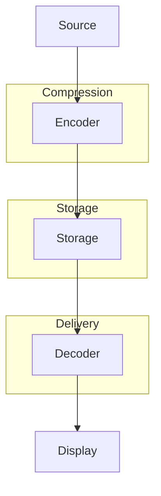
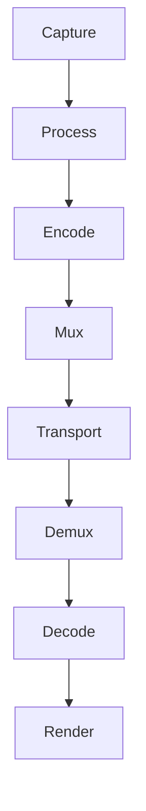

# نظم الوسائط المتعددة · Multimedia Systems

## 📐 التعاريف الأساسية · Core Definitions

- **الوسائط المتعددة** (Multimedia): دمج النصوص، الصور، الصوت، الفيديو.
- **الضغط** (Compression): تقليل حجم البيانات.
- **البث** (Streaming): بث المحتوى أثناء التحميل.
- **قواعد بيانات الوسائط** (Multimedia Databases): تخزين واستعلام الوسائط.
- **H.264** (AVC): معيار ضغط فيديو.
- **MP3**: معيارضغط الصوت.

---

## 🔁 نموذج النظام · System Model

### بنية النظام · System Architecture

### دورة الوسائط · Media Pipeline

---

## 🧮 النظريات والصيغ · Theorems & Formulas

### 1. ضغط الصوت · Audio Compression

#### MP3 Encoding

$$text{Bitrate} = 128 text{ kbps} = 16 text{ KB/s}$$

#### Sampling Rate

$$f_s = 2 times f_{max}$$
(Nyquist Rate)

#### Quantization

$$SNR_{dB} = 6.02 times B + 1.76$$
where $B$ = bits per sample

### 2. ضغط الفيديو · Video Compression

#### H.264 Profile

| Profile | Resolution | Bitrate |
| ---------- | --------- | -------- |
| **Baseline** | 480p | 1 Mbps |
| **Main** | 720p | 2 Mbps |
| **High** | 1080p | 10 Mbps |
| **High 10** | 4K | 20 Mbps |

#### Frame Types

- **I-Frame**: Self-contained
- **P-Frame**: References previous
- **B-Frame**: References both directions

### 3. معادلة الضغط · Compression Ratio

$$text{CR} = \frac{\text{Original Size}}{\text{Compressed Size}}$$

#### PSNR · Peak Signal-to-Noise Ratio

$$PSNR = 10 log_{10}\left(\frac{MAX^2}{MSE}\right)$$

#### SSIM · Structural Similarity

$$SSIM = \frac{(2\mu_x \mu_y + C_1)(2\sigma_{xy} + C_2)}{(\mu_x^2 + \mu_y^2 + C_1)(\sigma_x^2 + \sigma_y^2 + C_2)}$$

---

## 📊 جدول مرجعي · Reference Tables

### جدول معايير الضغط · Compression Standards

| المعيار | تطبيق | الضغط | الجودة |
| ---------- | ----- | ------ | ----- |
| **JPEG** | Images | 10:1 to 20:1 | ممتاز |
| **JPEG2000** | Images | 20:1 to 40:1 | ممتاز |
| **MP3** | Audio | 10:1 to 12:1 |good |
| **AAC** | Audio | 16:1 | أفضل من MP3 |
| **H.264** | Video | 50:1 to 100:1 | ممتاز |
| **H.265/HEVC** | Video | 100:1 to 200:1 | ممتاز |
| **VP9** | Video | 100:1 to 200:1 | ممتاز |
| **AV1** | Video | 100:1 to 200:1 | ممتاز |

### جدول صيغ الملفات · File Formats

| الصيغة | المحتوى | الضغط |
| ---------- | ----- | ----- |
| **MP4** | Video+Audio | H.264/AAC |
| **AVI** | Video+Audio |多种 |
| **MKV** | Video+Audio | أي |
| ** WAV** | Audio | غير مضغوط |
| **FLAC** | Audio | lossless |
| **MP3** | Audio | lossy |
| **GIF** | Images | lossy |
| **PNG** | Images | lossless |

### جدول البث · Streaming Protocols

| البروتوكول | الوصف | الاستخدام |
| ---------- | ----- | ----- |
| **RTSP** | Real Time Streaming Protocol | Control |
| **RTP** | Real-time Transport Protocol | Data |
| **RTCP** | RTP Control Protocol | Feedback |
| **HLS** | HTTP Live Streaming | HTTP-based |
| **DASH** | Dynamic Adaptive Streaming | HTTP-based |
| **RTMP** | Real-Time Messaging Protocol | Flash |

---

## 📝 أمثلة محلولة · Worked Examples

### مثال 1: حساب حجم ملف صوتي

**المعطيات:**
- Sampling rate: 44.1 kHz
- Bits per sample: 16 bit
- Channels: 2 (stereo)
- Duration: 3 minutes

**الحل:**
$$text{Size} = 44100 times 2 times 2 times 180$$
$$= 44100 times 4 times 180 = 31,752,000 text{ bytes}$$
$$= 30.3 \text{ MB}$$

**With MP3 (10:1 compression):**
$$= 3.03 text{ MB}$$

### مثال 2: حساب bandwidth للفيديو

**المعطيات:**
- Resolution: 1920x1080 (Full HD)
- Frame rate: 30 fps
- Bit per pixel: 0.1 bit

**الحل:**
$$text{Total pixels/frame} = 1920 times 1080 = 2,073,600$$
$$text{Bits/second} = 2,073,600 times 30 times 0.1 = 6,220,800 text{ bps}$$
$$= 6.22 text{ Mbps}$$

**With H.264 (100:1 compression):**
$$= 62.2 text{ kbps}$$

### مثال 3: Calculate Buffer Time

**المعطيات:**
- Bandwidth: 5 Mbps
- Video length: 30 seconds
- Buffer: 10 seconds

**الحل:**
$$\text{Time to buffer start} = \frac{10 \times 5}{5} = 10 \text{ seconds}$$
$$\text{Time to download complete} = 30 + 10 = 40 \text{ seconds}$$
$$\text{Start playback at: 10 seconds}$$

---

## ⚠️ أخطاء شائعة وملاحظات · Common Pitfalls & Notes

### ❌ أخطاء شائعة

1. **الخلط بين lossy و lossless:**
   - Lossless: استعيد original (ZIP, FLAC)
   - Lossy: لا استعيد (MP3, JPEG)
   - 💡 **ملاحظة**: Lossy achieves better compression!

2. **الخلط بين Bitrate و Bandwidth:**
   - Bitrate: معدل البيانات (bps)
   - Bandwidth: سعة القناة (Hz or bps)
   - Don't confuse!

3. **نسيان Frame Types:**
   - I-frame: full image
   - P-frame:_predicted from previous
   - B-frame: bidirectional
   - GOP: group of pictures

4. **عدم فهم Adaptive Streaming:**
   - DASH/HLS: adjust quality based on bandwidth
   - Multiple bitrates available
   - Client chooses based on network

### 💡 نصائح مهمة

- **تحسين الجودة:**
  - Use variable bitrate (VBR)
  - Enable hardware acceleration
  - Use proper profile

- **Content Delivery:**
  - CDN for distribution
  - Edge servers
  - Caching

- **Database Storage:**
  - Feature extraction
  - Similarity search
  - Indexing

### 📌 ملاحظات نهائية

- **Color Spaces:**
  - RGB: screens
  - YUV: video
  - HSV: image processing

- **Video Standards:**
  - PAL: 25 fps, 625 lines
  - NTSC: 30 fps, 525 lines

- **Audio Quality:**
  - CD: 44.1 kHz, 16-bit, stereo
  - DVD: 48 kHz, 24-bit
  - Hi-Res: 96 kHz+, 24-bit+