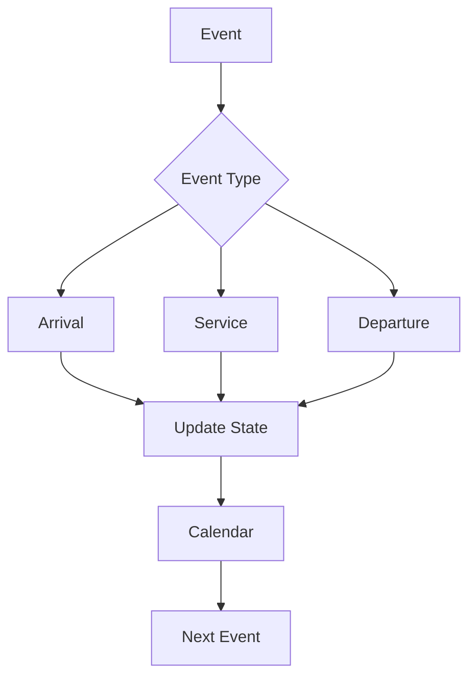
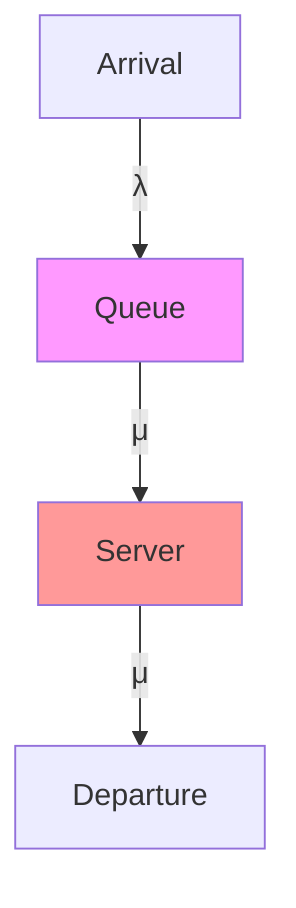
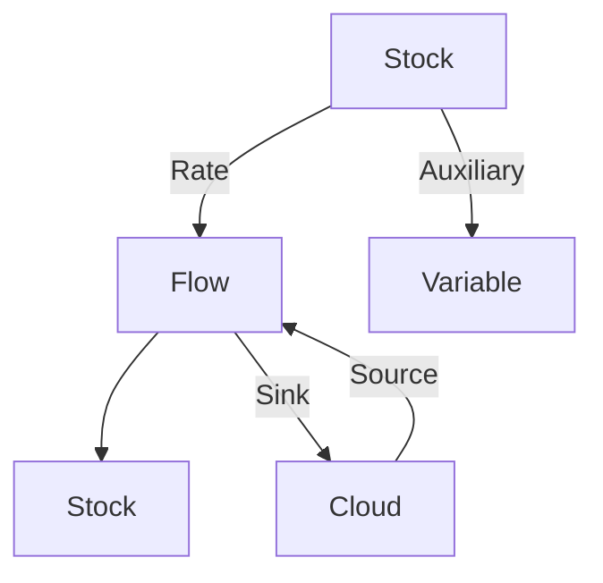
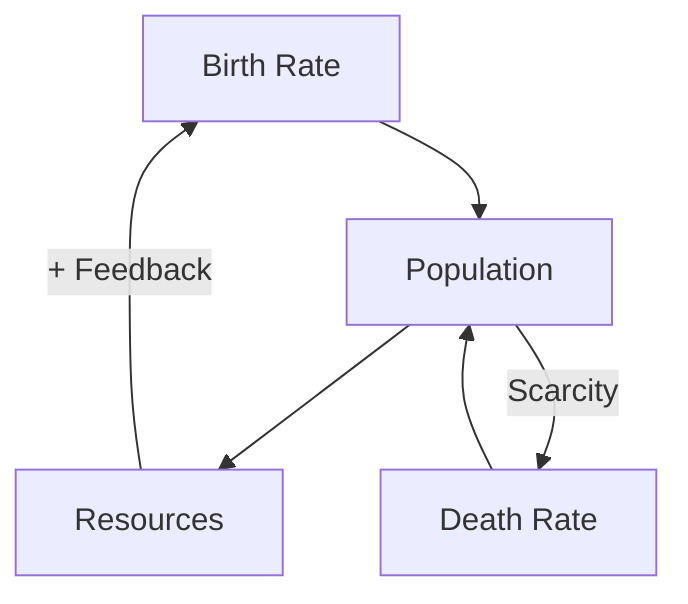
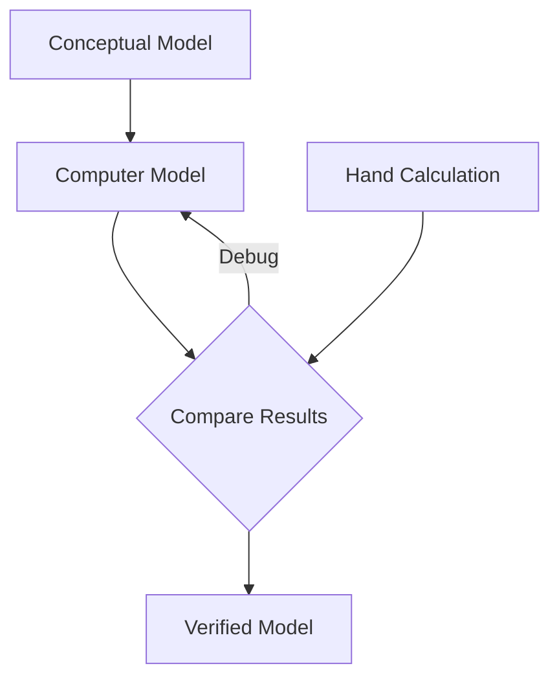
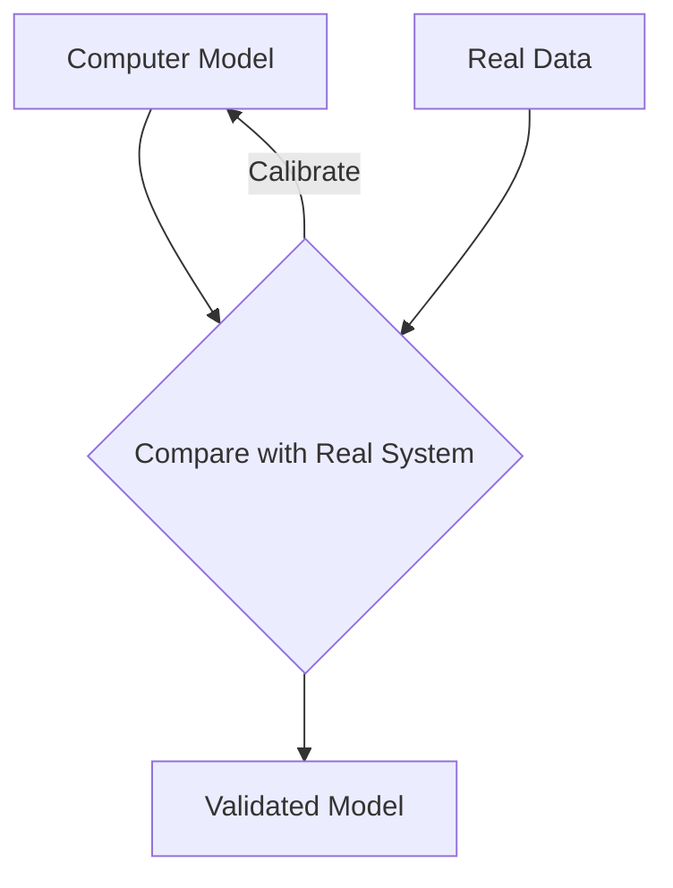
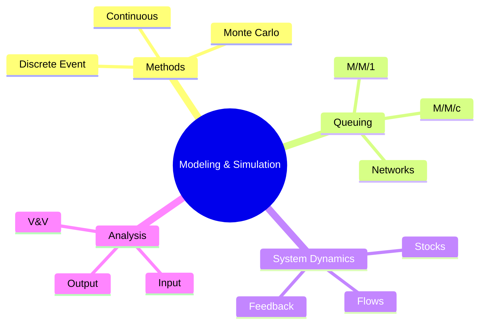

# نمذجة ومحاكاة (Modeling & Simulation)

## نظرة عامة (Overview)

```
┌─────────────────────────────────────────────────────────────┐
│            Modeling & Simulation                  │
├─────────────────────────────────────────────────────┤
│  Simulation → Monte Carlo → Queuing → Dynamics       │
└─────────────────────────────────────────────────────┘
```

---

## 1. طرق المحاكاة (Simulation Methods)

### Discrete Event Simulation (DES)



### Continuous Simulation

$$\frac{dx}{dt} = f(x, u, t)$$

```python
# Continuous simulation
import numpy as np
from scipy.integrate import odeint

def model(y, t, u):
    dxdt = -a * y + b * u
    return dxdt

t = np.linspace(0, 10, 100)
result = odeint(model, y0, t, args=(u,))
```

### Hybrid Simulation


---

## 2. Monte Carlo Simulation

### المبدأ الأساسي

$$E[X] = \frac{1}{N} \sum_{i=1}^{N} X_i$$

```python
# Monte Carlo estimation of Pi
import numpy as np

def estimate_pi(n):
    x = np.random.uniform(0, 1, n)
    y = np.random.uniform(0, 1, n)
    
    # Points inside unit circle
    inside = (x**2 + y**2) <= 1
    count = np.sum(inside)
    
    # Estimate Pi
    pi_estimate = 4 * count / n
    return pi_estimate

# Run simulation
for n in [100, 1000, 10000, 100000]:
    print(f"N={n}: Pi ≈ {estimate_pi(n):.6f}")
```

### Random Number Generation

| الموزع | الدالة |
|--------|---------|
| Uniform | $U(0,1)$ |
| Exponential | $F(x) = 1 - e^{-\lambda x}$ |
| Normal | $N(\mu, \sigma^2)$ |
| Poisson | $P(\lambda)$ |
| Weibull | $W(\lambda, k)$ |

```python
# Random variates
uniform = np.random.uniform(0, 1, 1000)
exponential = np.random.exponential(1/lambda, 1000)
normal = np.random.normal(mu, sigma, 1000)
poisson = np.random.poisson(lambda, 1000)
weibull = np.random.weibull(a, 1000)
```

### Variance Reduction

```python
# Control Variates
def control_variate(x, y):
    # Use Y to reduce variance of X
    cx = np.mean(x)
    cy = np.mean(y)
    beta = np.cov(x, y)[0,1] / np.var(y)
    return cx - beta * (cy - np.mean(y))

# Importance Sampling
def importance_sampling(f, g, n):
    x = g.rvs(n)
    weights = f.pdf(x) / g.pdf(x)
    return np.mean(weights * f.pdf(x))

# Antithetic Variates
def antithetic(f, n):
    u = np.random.uniform(0, 1, n)
    return 0.5 * (f(u) + f(1-u))
```

---

## 3. Queuing Models

### Kendall Notation

$$A/B/c/K/D$$

| الرمز | المعنى | القيم |
|-------|---------|--------|
| A | Arrival | M, D, G |
| B | Service | M, D, K |
| c | Servers | 1, 2, ..., ∞ |
| K | Capacity | 1, 2, ..., ∞ |
| D | Discipline | FCFS, LCFS, SJN |

### M/M/1 Queue



### Performance Metrics

| Metric | Formula |
|--------|---------|
| Utilization | $\rho = \lambda / \mu$ |
| P(empty) | $1 - \rho$ |
| Avg Queue Length | $L_q = \frac{\rho^2}{1-\rho}$ |
| Avg Waiting Time | $W_q = \frac{L_q}{\lambda}$ |
| Avg Time in System | $W = W_q + \frac{1}{\mu}$ |

```python
# M/M/1 queue metrics
def mm1_metrics(lambda_arrival, mu_service):
    rho = lambda_arrival / mu_service
    
    if rho >= 1:
        return "Unstable"
    
    Lq = rho**2 / (1 - rho)
    Wq = Lq / lambda_arrival
    W = Wq + 1/mu_service
    
    return {
        'utilization': rho,
        'queue_length': Lq,
        'waiting_time': Wq,
        'system_time': W
    }
```

### M/M/c Queue

```python
# M/M/c queue
def mmc_metrics(lambda_arrival, mu_service, c):
    rho = lambda_arrival / (c * mu_service)
    
    if rho >= 1:
        return "Unstable"
    
    # Probability all servers busy
    P0 = 1 / (sum((c*rho)**n / math.factorial(n) for n in range(c)) + 
              (c*rho)**c / (math.factorial(c) * (1-rho)))
    
    Lq = (P0 * (c*rho)**c * rho) / (math.factorial(c) * (1-rho)**2)
    Wq = Lq / lambda_arrival
    
    return {'utilization': rho, 'queue_length': Lq, 'waiting': Wq}
```

---

## 4. ديناميكيات النظم (System Dynamics)

### Components



### Equations

| العنصر | الصيغة |
|-------|--------|
| Stock | $\frac{dS}{dt} = In - Out$ |
| Flow | $F(t) = f(S, A)$ |
| Auxiliary | $A = g(S, F)$ |
| Parameter | $P = constant$ |

### Example: Population Model

```python
# Population growth model
def population_model(y, t, birth_rate, death_rate, carrying_capacity):
    population = y
    dPdt = birth_rate * population * (1 - population / carrying_capacity) - death_rate * population
    return dPdt

# Solve
from scipy.integrate import odeint
t = np.linspace(0, 100, 1000)
P = odeint(population_model, 100, t, args=(0.01, 0.005, 1000))
```

### Feedback Loops



---

## 5. Simulation Languages

### ARENA

```
┌─────────────────────────────────────────┐
│           ARENA Elements                 │
├─────────────────────────────────────────┤
│                                         │
│  MODULE: Create                          │
│    - Entity Arrival                    │
│    - Max Arrivals                      │
│                                         │
│  MODULE: Process                       │
│    - Action Type                      │
│    - Resources                        │
│    - Time                            │
│                                         │
│  MODULE: Dispose                       │
│    - Statistics                       │
│                                         │
│  MODULE: Assign                       │
│    - Entities                         │
│    - Variables                       │
│                                         │
│  MODULE: Decide                       │
│    - Condition                       │
│    - Type (2-way, n-way)             │
│                                         │
└─────────────────────────────────────────┘
```

### Simul8

```simul8
// Simul8 simulation
// Create components
CREATE: Arrival Point
QUEUE: Waiting Area
PROCESS: Service Station (3 resources)
DISPOSE: Exit Point

// Connect flow
Arrival Point → Waiting Area → Service Station → Exit Point
```

### GPSS

```gpss
* GPSS Simulation
GENERATE 5,2,100,30
QUEUE P1
SEIZE SERVER
ADVANCE 8,3
RELEASE SERVER
DEPART P1
TERMINATE 1
```

---

## 6. Simulation Analysis

### Input Analysis

```python
# Data fitting
from scipy import stats

# Fit distribution
data = np.array([...])
fitness = {}

for dist_name in ['expon', 'norm', 'gamma', 'weibull']:
    dist = getattr(stats, dist_name)
    params = dist.fit(data)
    fitness[dist_name] = dist.kstest(data, params)

best_dist = min(fitness, key=fitness.get)
```

### Output Analysis

| الطريقة | الوصف |
|-----------|-------|
| Replication | تكرار مستقل |
| Batch Means | 평균_batch |
| Spectral | تحليل_طيف |
| Regenerative | تجديدي |

```python
# Replication method
def replicate(system, n, k):
    results = [run_simulation(system, n) for _ in range(k)]
    mean = np.mean(results)
    ci = 1.96 * np.std(results) / np.sqrt(k)
    return mean, ci

# Batch means
def batch_means(data, batch_size):
    n_batches = len(data) // batch_size
    batches = [np.mean(data[i*batch_size:(i+1)*batch_size]) 
              for i in range(n_batches)]
    return np.mean(batches), np.std(batches)
```

---

## 7. Verification & Validation

### التحقق (Verification)



### التحقق (Validation)



### Techniques

| التقنية | الوصف |
|---------|-------|
| Trace | تتبع الكيانات |
| Tight Coupling | مقارنة وثيقة |
| Sensitivity | تحليل الحساسية |
| Face | التحقق البشري |

---

## 8. جدول المقارنات (Comparison Tables)

### Queue Models

|النموذج | ρ | L_q | W_q | الحالة |
|---------|----|-----|-----|--------|
| M/M/1 | <1 | $\frac{\rho^2}{1-\rho}$ | $\frac{\rho^2}{\lambda(1-\rho)}$ | محدد |
| M/M/c | <1 | Complex | Complex | محدد |
| M/D/1 | <1 | $\frac{\rho^2}{2(1-\rho)}$ | $\frac{\rho^2}{2\lambda(1-\rho)}$ | أفضل |

### Simulation Software

| البرمجيات | النوع | الاستخدام |
|------------|-------|------------|
| Arena | Commercial | العامة |
| Simul8 | Commercial | الأعمال |
| AnyLogic | Commercial | المتقدم |
| GPSS | Academic | التعليمية |
| SimPy | Open Source | Python |

---

## 9. مشاكل شائعة (Common Pitfalls)

### ⚠️ المشاكل

```warning
❌ Burn-in فترة غير كافية
❌ عدد تكرار غير كافٍ
❌ عدم استقلالية الأرقام العشوائية
❌ الخلط بين التحقق والتحقق
❌ نموذج خاطئ
❌忽略了 الأحداث النادرة
```

### ✅ الحلول

```python
# ✅ Warm-up period
def warm_up(run_length, system):
    warmup = 0.1 * run_length
    initialize(system)
    run_until(warmup)
    reset_statistics()
    run_until(run_length - warmup)
    return collect_results()

# ✅ Sufficient replications
def required_replications(alpha, beta, precision):
    from scipy import stats
    n = 2 * ((stats.norm.ppf(1-alpha/2) + stats.norm.ppf(1-beta)) * 
              sigma / precision)**2
    return int(np.ceil(n))
```

---

## 10. Applications

### Manufacturing

```python
# Production line simulation
class ProductionLine:
    def __init__(self, stations):
        self.stations = stations
    
    def simulate(self, arrival_rate, runtime):
        current_time = 0
        queue = []
        
        while current_time < runtime:
            # Generate arrival
            inter_arrival = np.random.exponential(1/arrival_rate)
            current_time += inter_arrival
            
            # Process at each station
            for station in self.stations:
                station.process(queue)
```

### Healthcare

```python
# Emergency department simulation
def ed_simulation(patient_arrivals, resources, runtime):
    # Track waiting times, utilization
    metrics = {
        'wait_times': [],
        'utilization': []
    }
    
    for patient in patient_arrivals:
        arrival_time = patient.arrival
        # Find available resource
        # Track wait time
        # Track service time
```

---

## 11. الأوامر السريعة (Quick Commands)

```python
# Simulation libraries
import simpy
import salabim

# SimPy
import simpy

def patient(env, name, bed, treat_time):
    print(f"{name} arrives at {env.now}")
    with bed.request() as request:
        yield request
        print(f"{name} gets bed at {env.now}")
        yield env.timeout(treat_time)
        print(f"{name} leaves at {env.now}")

env = simpy.Environment()
bed = simpy.Resource(env, capacity=2)
```

---

## 12. ملخص (Summary)



**Key Points:**
- 🎲 **Monte Carlo**: المحاكاة العشوائية
- 📊 **Queuing**: نظريات الطوابير
- 🔄 **System Dynamics**: ديناميكيات النظم
- ✅ **V&V**: التحقق والتصحيح
- 🏭 **Applications**: التطبيقات الصناعية