# هندسة البرمجيات 1 · Software Engineering I (Year 3 - Semester 2)

---

## 🔄 دورة حياة تطوير البرمجيات · SDLC

### النماذج · Models

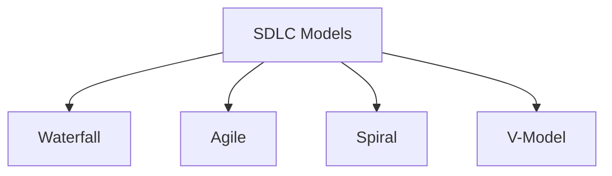

### 1. Waterfall Model

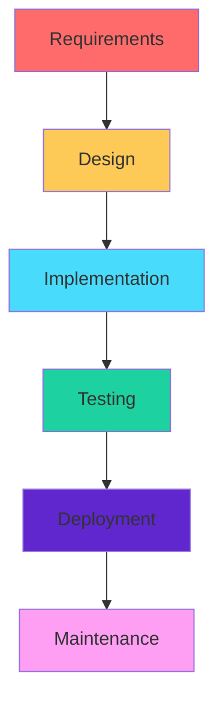

### 2. Agile Model

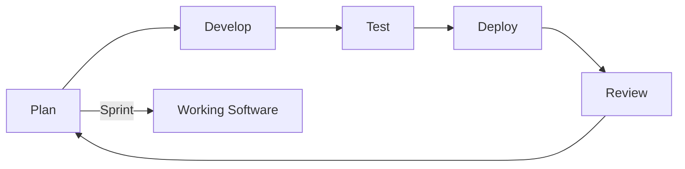

### 3. Spiral Model

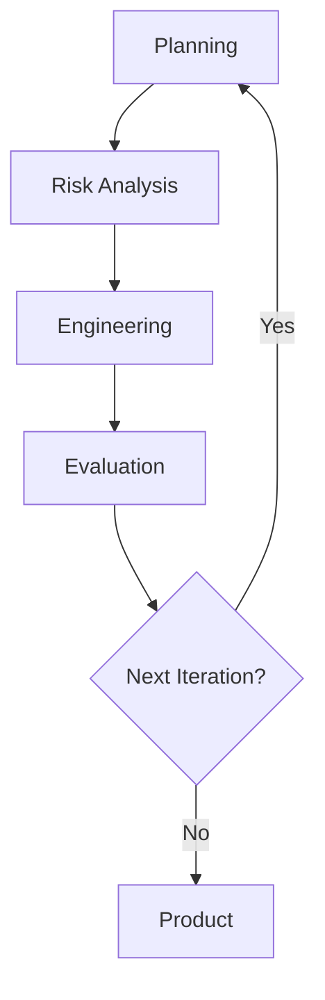

### مقارنة النماذج · Model Comparison

| النموذج | المميزات | العيوب | الاستخدام |
|---------|----------|--------|-----------|
| **Waterfall** | بسيط، واضح | غير مرن | مشاريع صغيرة |
| **Agile** | مرن، تسليم سريع | غير منظم | مشاريع متغيرة |
| **Spiral** | إدارة مخاطر | معقد | مشاريع كبيرة |
| **V-Model** | اختبار مبكر | مكلفة | أنظمة حرجة |

---

## 📋 المتطلبات · Requirements

### 1. أنواع المتطلبات · Requirement Types

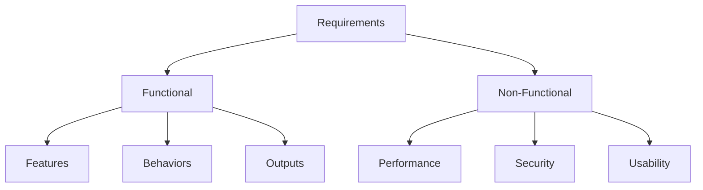

### 2. هرم المتطلبات · Requirements Pyramid

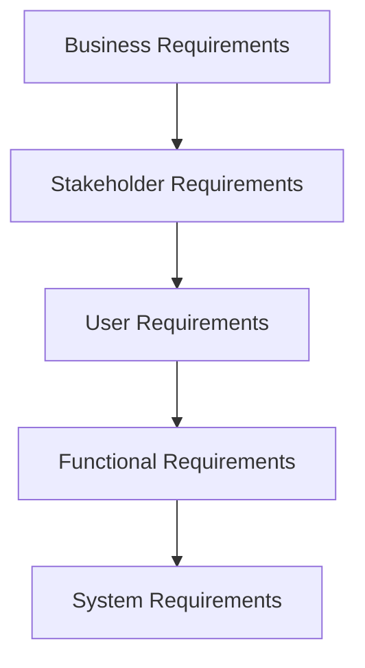

### 3. توثيق المتطلبات · Documentation

#### SRS (Software Requirements Specification)

```python
# مثال: Requirement Template
requirement_template = {
    'id': 'REQ-001',
    'title': 'User Authentication',
    'description': 'System shall authenticate users',
    'priority': 'High',
    'type': 'Functional',
    'source': 'Stakeholder',
    'dependencies': ['REQ-002']
}
```

#### SMART Requirements

| الحرف | المعنى | الوصف |
|-------|--------|-------|
| **S** | Specific | محدد |
| **M** | Measurable | قابل للقياس |
| **A** | Achievable | قابل للتحقيق |
| **R** | Relevant | ملائم |
| **T** | Time-bound | محدد بوقت |

---

## 🎨 أنماط التصميم · Design Patterns

### 1. أنماط الإنشاء · Creational Patterns

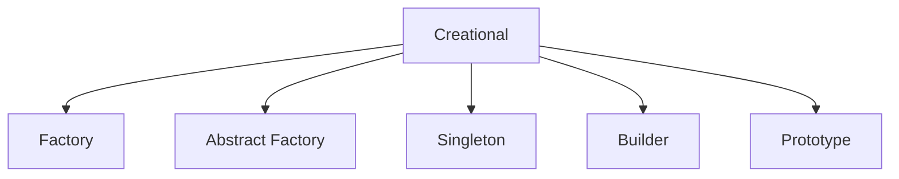

#### Singleton

```python
class Singleton:
    _instance = None
    
    def __new__(cls):
        if cls._instance is None:
            cls._instance = super().__new__(cls)
        return cls._instance
```

#### Factory Method

```python
class Factory:
    def create_product(self, product_type):
        if product_type == 'A':
            return ProductA()
        elif product_type == 'B':
            return ProductB()
        raise ValueError('Invalid type')
```

### 2. أنماط الهيكلية · Structural Patterns

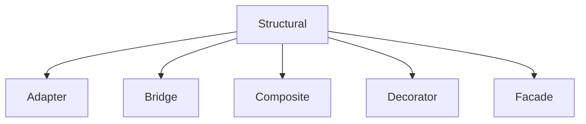

#### Adapter

```python
class Target:
    def request(self):
        return 'Target: Default behavior'

class Adaptee:
    def specific_request(self):
        return 'Specific behavior'

class Adapter(Target):
    def __init__(self, adaptee):
        self.adaptee = adaptee
    
    def request(self):
        return f'Adapter: {self.adaptee.specific_request()}'
```

#### Decorator

```python
class Component:
    def operation(self):
        return 'Component'

class Decorator(Component):
    def __init__(self, component):
        self.component = component
    
    def operation(self):
        return f'Decorator({self.component.operation()})'
```

### 3. أنماط السلوكية · Behavioral Patterns

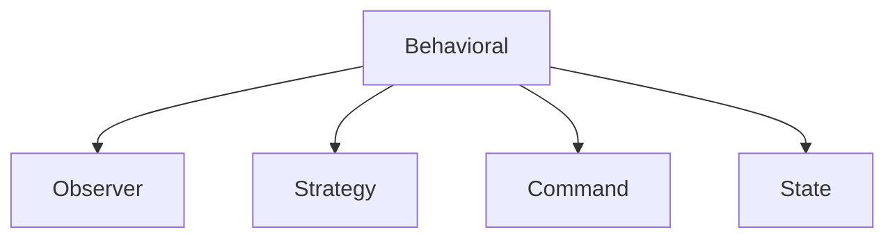

#### Observer

```python
class Subject:
    def __init__(self):
        self.observers = []
    
    def attach(self, observer):
        self.observers.append(observer)
    
    def notify(self):
        for observer in self.observers:
            observer.update(self)

class Observer:
    def update(self, subject):
        pass
```

#### Strategy

```python
class Context:
    def __init__(self, strategy):
        self.strategy = strategy
    
    def execute_strategy(self, data):
        return self.strategy.execute(data)

class StrategyA:
    def execute(self, data):
        return f'Strategy A: {data}'

class StrategyB:
    def execute(self, data):
        return f'Strategy B: {data}'
```

---

## 🧪 الاختبار · Testing

### أنواع الاختبار · Testing Types

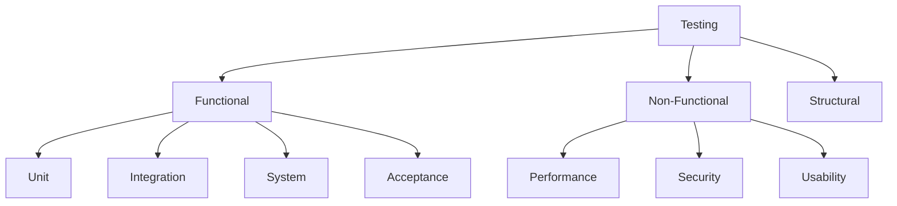

### 1. اختبار الوحدة · Unit Testing

```python
import unittest

class TestMathOperations(unittest.TestCase):
    def setUp(self):
        self.calc = Calculator()
    
    def test_add(self):
        self.assertEqual(self.calc.add(2, 3), 5)
    
    def test_divide(self):
        with self.assertRaises(ZeroDivisionError):
            self.calc.divide(1, 0)
    
    def tearDown(self):
        pass
```

### 2. اختبار التكامل · Integration Testing

```python
def test_integration():
    """اختبار التكامل بين الوحدات"""
    # Top-down integration
    # Bottom-up integration
    # Sandwich integration
    pass
```

### 3. اختبار النظام · System Testing

```python
def test_system():
    """اختبار النظام الكامل"""
    # Functional testing
    # Performance testing
    # Security testing
    pass
```

### 4. اختبار الألفا والبيتا

| النوع | المختبرين | الغرض |
|-------|------------|--------|
| **Alpha** | المطورون | داخلي |
| **Beta** | المستخدمون | خارجي |

---

## 📊 لغة النمذجة الموحدة · UML

### 1. مخططات الفئة · Class Diagrams

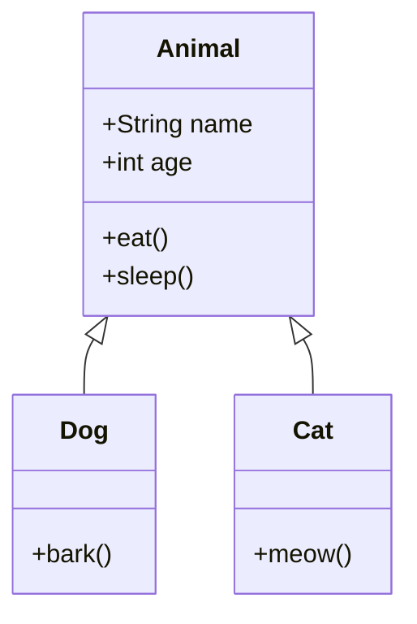

### 2. مخططات التسلسل · Sequence Diagrams

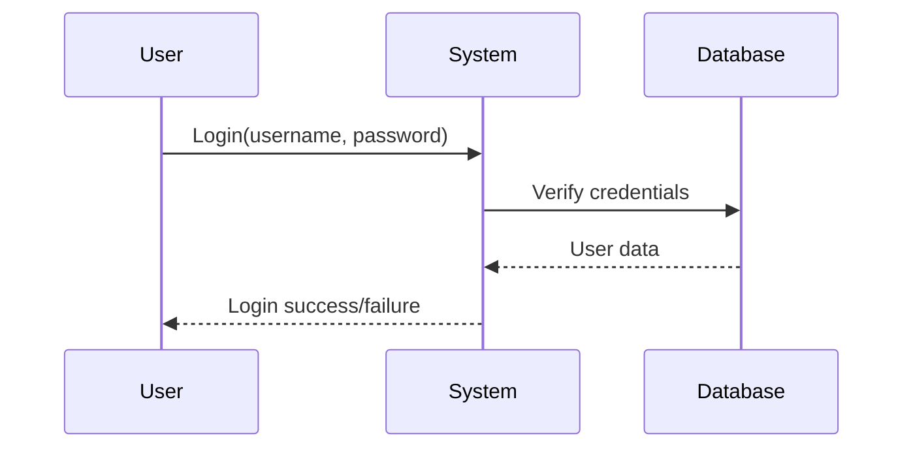

### 3. مخططات الحالة · State Diagrams

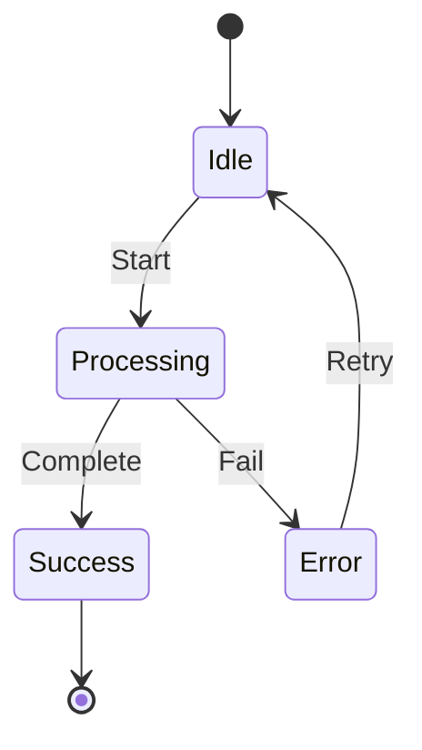

### 4. مخططات الأنشطة · Activity Diagrams

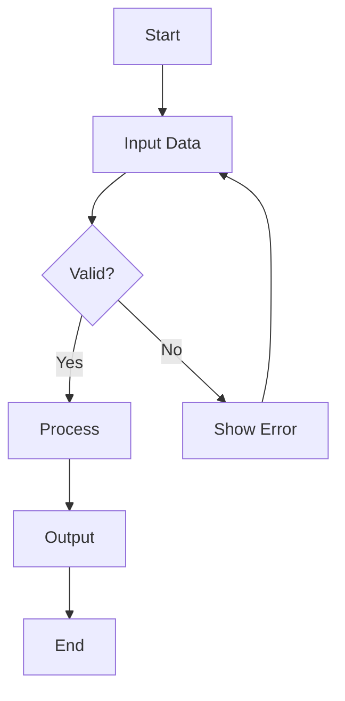

### 5. مخططات_use_case

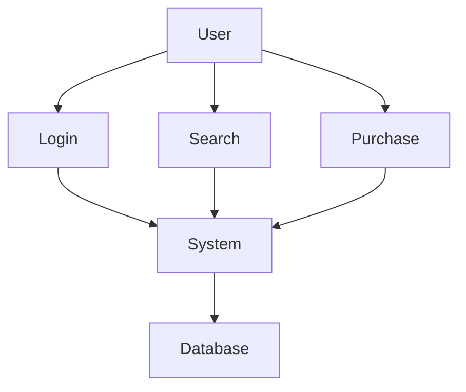

### أنواع UML

| النوع | الاستخدام |
|-------|-----------|
| **Class** | بنية النظام |
| **Object** | حالات النظام |
| **Sequence** | التفاعلات |
| **Activity** | العمليات |
| **State** | حالات الكائن |
| **Use Case** | المتطلبات |

---

## 📊 جدول مرجعي شامل · Master Reference Table

### أنماط التصميم

| النمط | النوع | الوصف |
|-------|-------|-------|
| **Singleton** | Creational | حالة واحدة |
| **Factory** | Creational | إنشاء كائنات |
| **Adapter** | Structural | توافق الواجهات |
| **Decorator** | Structural | إضافة سلوك |
| **Observer** | Behavioral | إشعار التغيير |
| **Strategy** | Behavioral | خوارزمية قابلة للتبديل |

### مستويات الاختبار

| المستوى | الوحدة | التكامل | النظام | القبول |
|---------|--------|---------|--------|--------|
| **الاختبار** | المطور | فريق الاختبار | فريق مستقل | المستخدم |
| **التركيز** | الوظائف | التكامل | المتطلبات | العمليات |

### نماذج SDLC

| النموذج | Flexibility | Cost | Time | Risk |
|---------|-------------|------|------|------|
| **Waterfall** | منخفض | منخفض | ثابت | عالي |
| **Agile** | عالي | متغير | متغير | منخفض |
| **Spiral** | متوسط | عالي | متغير | منخفض |

---

## ⚠️ أخطاء شائعة وملاحظات · Common Pitfalls & Notes

### ❌ أخطاء شائعة

1. **المتطلبات غير واضحة:**
   - استخدام مصطلحات مبهمة
   - عدم التحديد بالكمية

2. **تجنب الاختبار:**
   - "الاختبار يأخذ وقت"
   - "الكود يعمل"

3. **تجاهل أنماط التصميم:**
   - إعادة اختراع العجلة
   - كود غير قابل للصيانة

4. **UML غير دقيق:**
   - رسم عام وليس تفصيلي
   - عدم تحديث المخططات

5. **SDLC غير ملائم:**
   - استخدام Waterfall لمشروع متغير
   - استخدام Agile لنظام ثابت

### ❌ مفاهيم خاطئة شائعة

- **"المتطلبات تتغير":** التغيير مكلف
- **"الاختبار بعد التطوير":** الاختبار المبكر أفضل
- **"التصميم مهم多余的":** التصميم يبسط التنفيذ

### 💡 نصائح مهمة

- **للمتطلبات:**
  - Use Cases واضحة
  - Acceptance criteria محددة

- **للتصميم:**
  - SOLID principles
  - DRY (Don't Repeat Yourself)

- **للاختبار:**
  - Test-driven development
  - Code coverage

---

## 📝 أمثلة محلولة · Worked Examples

### مثال 1: RequirementSMART

**السؤال:** "النظام يجب أن يكون سريع"

**تصحيح:**
- **الـ SMART:** "النظام должен ответить على запрос за أقل من 200ms عند 1000 مستخدم متزامن"

### مثال 2: Singleton Pattern

**سيناريو:** مدير قاعدة البيانات

**الحل:**
```python
class DatabaseManager:
    _instance = None
    
    def __new__(cls):
        if cls._instance is None:
            cls._instance = super().__new__(cls)
            cls._instance.connection = None
        return cls._instance
```

### مثال 3: Observer Pattern

**سيناريو:** نظام الإشعارات

**الحل:**
```python
class NewsAgency(Subject):
    def __init__(self):
        self.subscribers = []
        self.latest_news = None
    
    def attach(self, observer):
        self.subscribers.append(observer)
    
    def notify(self):
        for sub in self.subscribers:
            sub.update(self.latest_news)
```

### مثال 4: Unit Test

**سيناريو:** اختبار دالة تسجيل الدخول

**الحل:**
```python
def test_login_success():
    user = User('test', 'pass123')
    result = login(user)
    assert result == True

def test_login_failure():
    user = User('test', 'wrong')
    result = login(user)
    assert result == False
```

---

(End of file)
