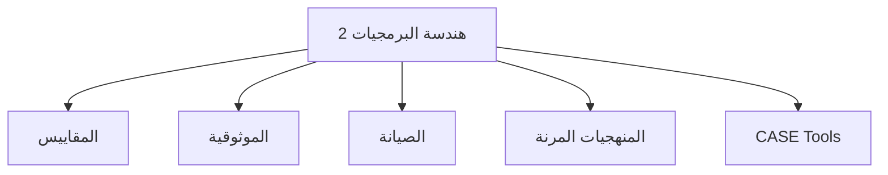
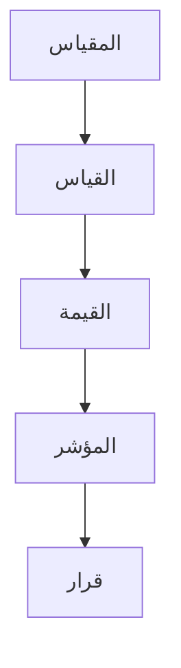
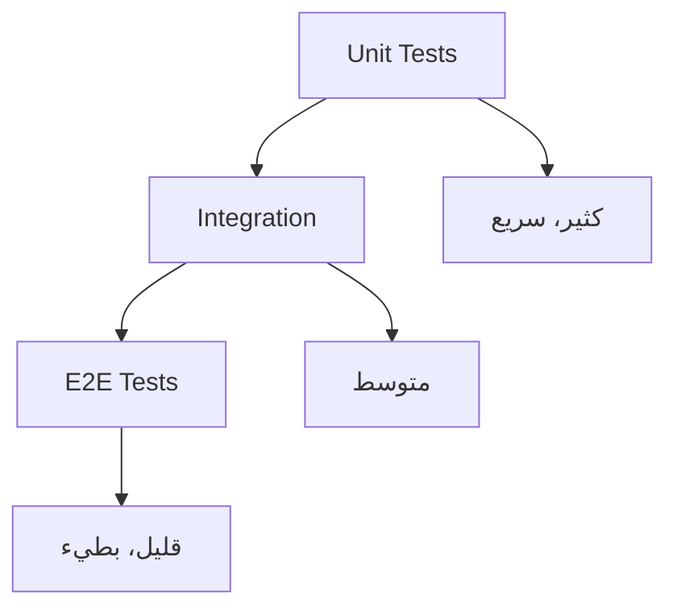
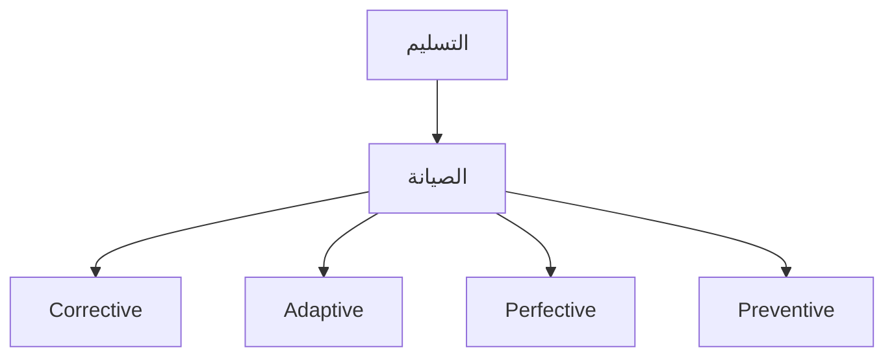
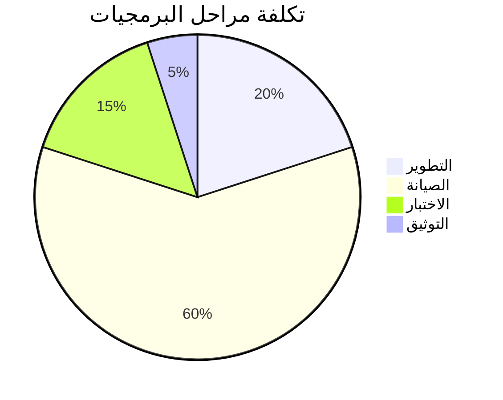
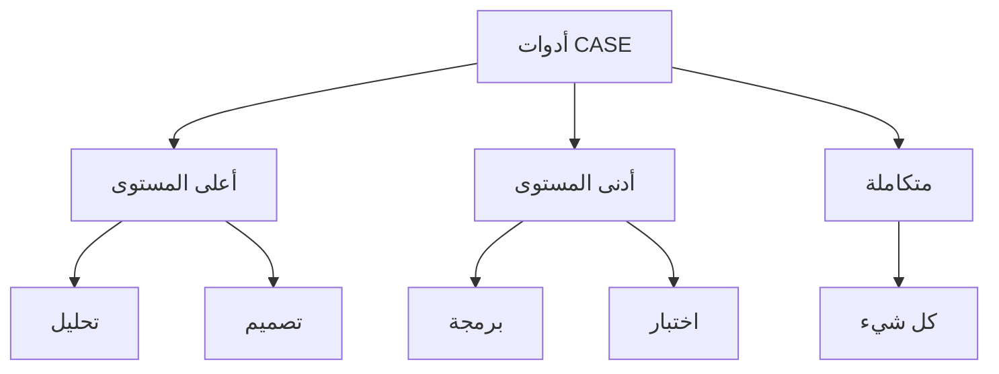
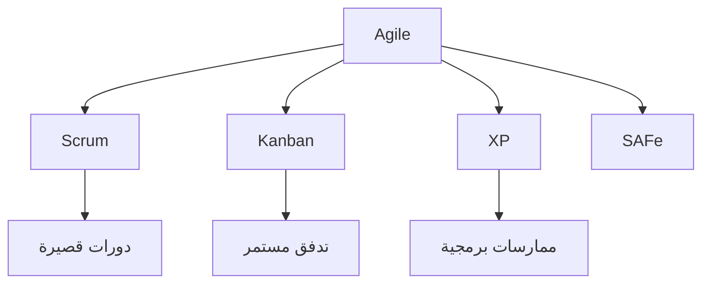
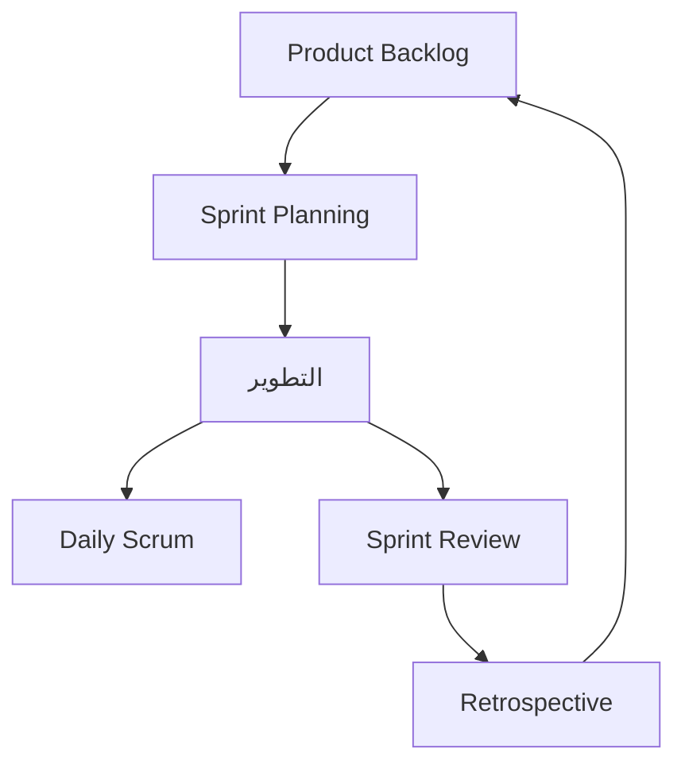
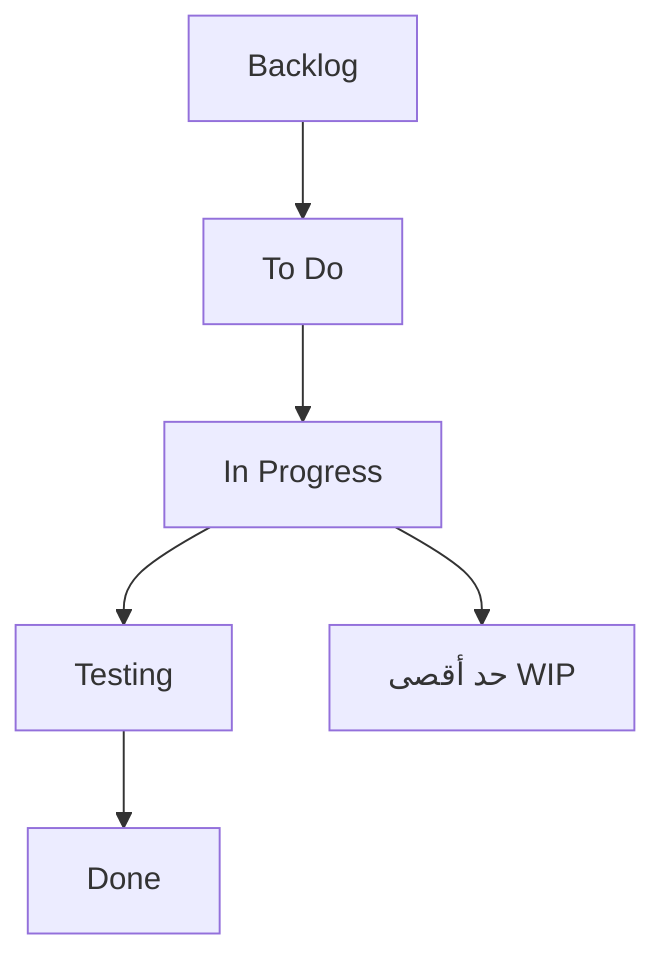
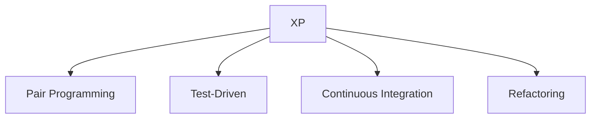

# هندسة البرمجيات 2 · Software Engineering 2 (Year 4 - Semester 2)

## 📊 مقدمة في هندسة البرمجيات المتقدمة · Advanced Software Engineering Intro

### مفهوم هندسة البرمجيات 2 · SE2 Concept

- **هندسة البرمجيات 2**: دراسة متقدمة تشمل المقاييس والموثوقية والصيانة ومنهجيات ágile.
- **الكفاءة البرمجية** (Software Productivity): قياس إنتاجية فريق التطوير.



---

## 📐 المقاييس البرمجية · Software Metrics

### مفهوم المقاييس · Metrics Concept

- **المقياس** (Metric): قياس كمي لخاصية من خصائص البرمجيات.
- **المؤشر** (Indicator): مؤشر يعتمد على مقاييس متعددة.



### أنواع المقاييس · Metric Types

| النوع | الوصف | أمثلة |
|-------|-------|-------|
| **حجم** (Size) | قياس الحجم | LOC, FP |
| **تعقيد** (Complexity) | قياس التعقيد | Cyclomatic |
| **جودة** (Quality) | قياس الجودة | defects/KLOC |
| **سرعة** (Productivity) | قياس الإنتاجية | LOC/person-month |

### مقاييس الحجم · Size Metrics

#### سطور الكود (LOC)

```python
# مثال PHP
function calculate($a, $b) {
    return $a + $b;  # 1 سطر برمجي
}
```

**أنواع LOC:**
- **Physical LOC**: كل السطور
- **Logical LOC**: سطور المصدر الفعلي (excludes comments/blank)

#### نقاط الوظيفة (FP)

$$FP = \sum (UFC \times VAF)$$

where:
- $UFC$: Functional Complexity
- $VAF$: Value Adjustment Factor = $0.65 + 0.01 \times \sum F_i$

### مقاييس التعقيد · Complexity Metrics

#### تعقيد Cyclomatic

$$M = E - N + 2P$$

where:
- $E$: عدد_edges
- $N$: عدد_nodes
- $P$: عدد_components

```mermaid
graph TD
    A[Start] --> B{شرط}
    B -->|نعم| C[الفرع 1]
    B -->|لا| D[الفرع 2]
    C --> E[End]
    D --> E
    
    M = 3 - 2 + 2 = 3 مسارات
```

#### تعقيد التحكم

- **Cog nitive Complexity**: صعوبة فهم الكود
- **Coupling**: درجة الترابط بين الوحدات
- **Cohesion**: درجة التماسك داخل الوحدة

### مقاييس الجودة · Quality Metrics

| المقياس | الصيغة | الهدف |
|---------|--------|-------|
| **Defect Density** | defects / KLOC | أقل أفضل |
| **MTTF** | Mean Time To Failure | أعلى أفضل |
| **Availability** | MTBF / (MTBF + MTTR) | 100% مثالي |
| **Yield** | % code without defects | أعلى أفضل |

---

## 🔧 الموثوقية · Reliability

### مفهوم الموثوقية · Reliability Concept

- **الموثوقية** (Reliability): احتمالية عمل النظام بشكل صحيح لفترة زمنية معينة.
- **متوسط الوقت بين الفشل** (MTBF): Mean Time Between Failures.

$$R(t) = e^{-\lambda t}$$

where $\lambda$ is the failure rate.

### نماذج الموثوقية · Reliability Models

#### 1. نموذج Exponential

$$R(t) = e^{-\lambda t}$$

#### 2. نموذج Weibull

$$R(t) = e^{-(t/\alpha)^\beta}$$

where:
- $\alpha$: scale parameter
- $\beta$: shape parameter

#### 3. نموذج Rayleigh

$$R(t) = e^{-t^2 / 2\sigma^2}$$

### هرم الاختبار · Testing Pyramid



### طرق تحسين الموثوقية

| الطريقة | الوصف |
|---------|-------|
| **Redundancy** | تكرار المكونات |
| **Error Detection** | اكتشاف الأخطاء |
| **Recovery** | استعادة النظام |
| **Graceful Degradation** | تدهور سلس |

---

## 🔄 الصيانة · Maintenance

### مفهوم الصيانة · Maintenance Concept

- **الصيانة** (Maintenance): تعديل البرمجيات بعد التسليم لتحسينها أو تصحيحها.



### أنواع الصيانة · Maintenance Types

| النوع | النسبة | الوصف |
|-------|--------|-------|
| **تصحيحية** (Corrective) | 20% | إصلاح الأخطاء |
| **تكيفية** (Adaptive) | 25% | تغيير البيئة |
| **تحسينية** (Perfective) | 50% | تحسين الأداء/وظائف |
| **وقائية** (Preventive) | 5% | منع المشاكل |

### نماذج الصيانة · Maintenance Models

#### نموذج المكونات

$$M = A + B \times (C-D)^E$$

where:
- $A$: صيانة التصحيحية الأساسية
- $B$: جهد التطوير الأولي
- $C$: التعقيد الأولي
- $D$: التعقيد الحالي
- $E$: معلمة التعلم

### تكاليف دورة الحياة · Lifecycle Cost



---

## 🛠️ أدوات CASE · CASE Tools

### مفهوم CASE · CASE Concept

- **أدوات CASE**: برمجيات مساعدة في تطوير البرمجيات.
- **أهداف**: أتمتة العملية، تحسين الجودة، توثيق أفضل.

### أنواع أدوات CASE



### وظائف CASE

| الوظيفة | الوصف | الأدوات |
|---------|-------|--------|
| **المحلل** (Analyzer) | تحليل الكود | lint, SonarQube |
| **المصمم** (Designer) | تصميم الواجهات | Figma, Lucidchart |
| **المبرمج** (Coder) | توليد الكود | IDEs, Boilerplate |
| **المختبر** (Tester) | الاختبار الآلي | Selenium, JUnit |

### أدوات شائعة

| الأداة | الوظيفة | اللغة |
|--------|---------|-------|
| **Visual Paradigm** | UML | Java, C# |
| **Enterprise Architect** | UML | متعدد |
| **Jira** | إدارة المشاريع | - |
| **Jenkins** | CI/CD | متعدد |
| **SonarQube** | تحليل الجودة | متعدد |

---

## 🏃 منهجيات Agile · Agile Methods

### مفهوم Agile · Agile Concept

- **المنهجيات المرنة**: منهجيات تطوير تركز على التكرار والتكيف.



### Scrum



### Kanban



### XP (Extreme Programming)



### مقارنة المنهجيات

| الميزة | Waterfall | Scrum | Kanban |
|--------|-----------|-------|--------|
| **المرونة** | منخفضة | عالية | عالية |
| **التعقيد** | منخفض | متوسط | عالي |
| **التحكم** | عالي | متوسط | منخفض |
| **المخاطر** | عالي | منخفض | منخفض |

---

## 📊 جدول مرجعي شامل · Master Reference Table

### مقاييس LOC

| المقياس | الوصف | المعادلة |
|---------|-------|----------|
| **KLOC** | ألف سطر كود | LOC / 1000 |
| **DLOC** | سطور قابلة للتوزيع | Total - Comments |
| **KLOC/month** | الإنتاجية | LOC / months |

### مؤشرات الجودة

| المؤشر | الهدف | التحسين |
|--------|-------|----------|
| **Defects/KLOC** | < 1 | مراجعة الكود |
| **Code Coverage** | > 80% | اختبارات أكثر |
| **Cyclomatic** | < 10 | تبسيط |
| **Coupling** | < 20% | إعادة هيكلة |

### معادلات الموثوقية

| النموذج | الصيغة |
|---------|--------|
| **Exponential** | $R(t) = e^{-\lambda t}$ |
| **Weibull** | $R(t) = e^{-(t/\alpha)^\beta}$ |
| **Logistic** | $R(t) = \frac{1}{1+e^{-\alpha(t-\beta)}}$ |

---

## ⚠️ أخطاء شائعة وملاحظات · Common Pitfalls & Notes

### ❌ أخطاء شائعة

1. **المقاييس**:
   - الاعتماد على مقياس واحد فقط
   - قياس بلا تحليل

2. **الموثوقية**:
   - إهمال الاختبار
   - عدم وجود خطة طوارئ

3. **الصيانة**:
   - توثيق ضعيف
   - كود غير قابل للاختبار

4. **CASE**:
   - أدوات لا تناسب المشروع
   - عدم التدريب الكافي

5. **Agile**:
   - تطبيق جزئي
   - تجاهل التوثيق

### 💡 نصائح مهمة

- **Measure what matters**: ركز على مقاييس ذات معنى
- **Automation**: أتمتة ما يمكن
- **Continuous Improvement**: التحسين المستمر
- **Technical Debt**: إدارة الدين التقني

### 📌 ملاحظات نهائية

- **LOC ليس كل شيء**: التعقيد والجودة أهم
- **الصيانة = 60% من التكلفة**: خطط لها
- **Agile ليست مناسبة لكل شيء**: اختر بحكمة
- **CASE tools help but don't replace**: الأدوات مساعدة

---

## 📝 أمثلة محلولة · Worked Examples

### مثال 1: حساب نقاط الوظيفة

**المعطيات:**
-_external inputs: 4 (Low complexity)
-_external outputs: 2 (Average)
-_external inquiries: 1 (Low)
-_internal files: 3 (High)
-_external interfaces: 1 (Low)

**الحل:**

| النوع | UFC | التعقيد | المجموع |
|-------|-----|----------|--------|
| EI | 4 | ×3 | 12 |
| EO | 2 | ×4 | 8 |
| EQ | 1 | ×3 | 3 |
| ILF | 3 | ×7 | 21 |
| EIF | 1 | ×5 | 5 |

- UFC Total = 49
- VAF = 0.65 + 0.01 × 14 = 0.79
- FP = 49 × 0.79 = 38.71

### مثال 2: تعقيد Cyclomatic

```python
if a > 0:        # 1
    if b > 0:    # 2
        x = 1
    else:        # +1
        x = 2
else:            # +1
    x = 3
```

$$M = 8 - 6 + 2 = 4$$

**عدد المسارات المستقلة**: 4

### مثال 3: موثوقية exponential

**المعطيات:**
- λ = 0.001 failure/hour
- t = 1000 hours

**الحل:**

$$R(1000) = e^{-0.001 \times 1000} = e^{-1} = 0.368$$

**الاحتمالية**: 36.8% للعمل لمدة 1000 ساعة

---

(End of file)