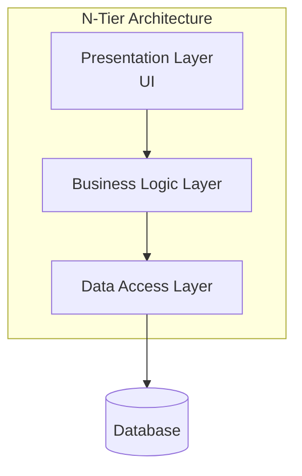
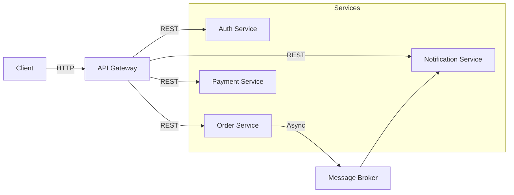
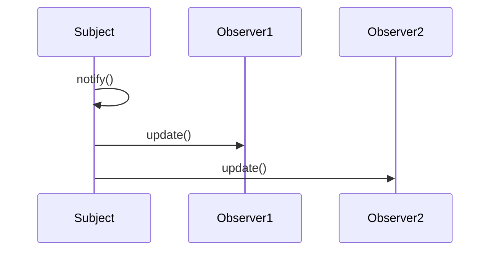
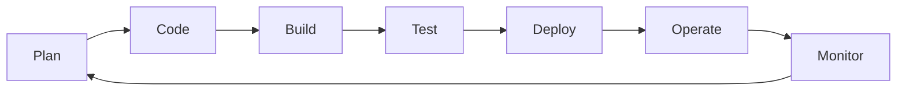
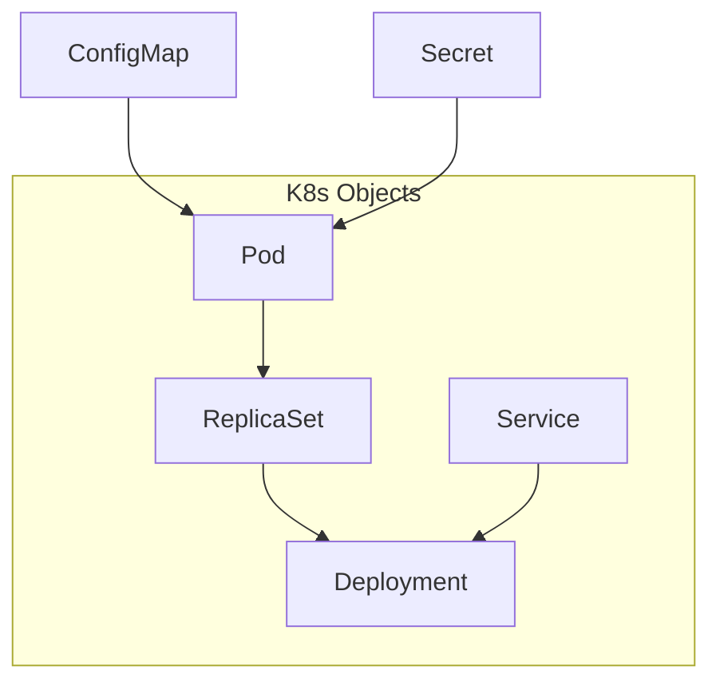
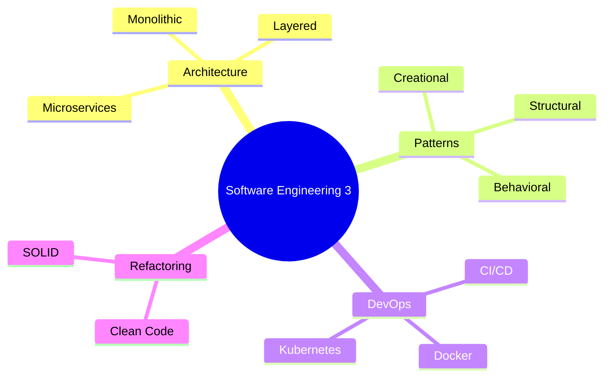

# هندسة البرمجيات 3 (Software Engineering 3)

## نظرة عامة (Overview)

```
┌─────────────────────────────────────────────────────────────┐
│              Software Engineering 3                 │
├─────────────────────────────────────────────────────┤
│  Architecture → Patterns → DevOps → CI/CD           │
└─────────────────────────────────────────────────────┘
```

---

## 1. هندسة البرمجيات (Software Architecture)

### أنماط الهندسة المعمارية (Architectural Styles)

| النمط | الوصف | المزايا | العيوب |
|-------|-------|---------|--------|
| Monolithic | تطبيق واحد | بسيط, نشر سهل | صعب الصيانة |
| Layered | طبقات متعددة | واضح, منفصل | قد يكون بطيء |
| Client-Server | عميل-خادم | توزيع الموارد | تعقيد الشبكة |
| Microservices | خدمات صغيرة | مرن, قابل للتوسع | تعقيد الإعداد |
| Event-Driven | موجّه بالأحداث | loosely coupled | صعب التتبع |

### نمط الطبقات (Layered Architecture)



### نمط microservices



---

## 2. أنماط التصميم (Design Patterns)

### أنماط الإنشاء (Creational Patterns)

| النمط | الوصف | UML |
|-------|-------|-----|
| Singleton | نسخة واحدة | `static instance` |
| Factory Method | إنشاء كائنات | `create()` |
| Abstract Factory | مصنع مجازي | `createFamily()` |
| Builder | بناء تدريجي | `build()` |
| Prototype | استنساخ | `clone()` |

### Singleton Pattern

```python
# Python Singleton
class Singleton:
    _instance = None
    
    def __new__(cls):
        if cls._instance is None:
            cls._instance = super().__new__(cls)
        return cls._instance

# Usage
obj1 = Singleton()
obj2 = Singleton()
print(obj1 is obj2)  # True
```

### Factory Method

```python
from abc import ABC, abstractmethod

class Document(ABC):
    @abstractmethod
    def render(self):
        pass

class PDFDocument(Document):
    def render(self):
        return "Rendering PDF..."

class WordDocument(Document):
    def render(self):
        return "Rendering Word..."

class DocumentFactory:
    @staticmethod
    def create_doc(doc_type: str) -> Document:
        factories = {
            'pdf': PDFDocument,
            'word': WordDocument
        }
        return factories[doc_type]()
```

### نمط Strategy Pattern

```python
# Strategy Pattern
class PaymentStrategy(ABC):
    @abstractmethod
    def pay(self, amount: float):
        pass

class CreditCardPayment(PaymentStrategy):
    def __init__(self, card_number: str):
        self.card_number = card_number
    
    def pay(self, amount: float):
        return f"Paid ${amount} via Credit Card"

class PayPalPayment(PaymentStrategy):
    def pay(self, amount: float):
        return f"Paid ${amount} via PayPal"

class ShoppingCart:
    def __init__(self, payment_strategy: PaymentStrategy):
        self.payment_strategy = payment_strategy
    
    def checkout(self, amount: float):
        return self.payment_strategy.pay(amount)
```

### نمط Observer Pattern



```python
class Subject:
    def __init__(self):
        self._observers = []
    
    def attach(self, observer):
        self._observers.append(observer)
    
    def detach(self, observer):
        self._observers.remove(observer)
    
    def notify(self):
        for observer in self._observers:
            observer.update(self)
```

### أنماط Behavior

| النمط | الوصف | الاستخدام |
|-------|-------|-------------|
| Observer | الإخطار | DOM events, MVC |
| Strategy | تبديل الخوارزميات | Payment, Sorting |
| Command | تغليف الطلبات | Undo, Queue |
| State | تغيير السلوك | State machines |
| Chain of Responsibility | معالجة متسلسلة | Filters, Middleware |

---

## 3. إعادة الهيكلة (Refactoring)

### علامات الحاجة لإعادة الهيكلة

```warning
❌ دوال طويلة (Long Methods)
❌ فصول كبيرة (Large Classes)
❌ تكرار الكود (Duplicated Code)
❌ تبعيات معقدة (Tight Coupling)
❌ كود ميت (Dead Code)
❌ أسماء مضللة (Misleading Names)
```

### تقنيات إعادة الهيكلة

| التقنية | الوصف | مثال |
|---------|-------|-----|
| Extract Method | استخراج دالة | `calculateTotal()` → `calcSubTotal() + calcTax()` |
| Rename Variable | إعادة تسمية | `x` → `userAge` |
| Move Method | نقل دالة | من `User` إلى `UserService` |
| Introduce Parameter Object | كائن معامل | multiple params → `Filter object` |
| Replace Conditional | نمط Strategy | `if/else` → strategy pattern |

### مثال إعادة الهيكلة

```diff
- # Before: Long function
- def calculate Invoice(order):
-     total = 0
-     for item in order.items:
-         total += item.price * item.quantity
-         if item.is_taxable:
-             total += item.price * item.quantity * 0.1
-     if order.customer.discount > 0:
-         total -= total * order.customer.discount
-     if order.shipping == 'express':
-         total += 25
-     return total
+ # After: Extracted methods
+ def calculate_invoice(order):
+     subtotal = order.calculate_subtotal()
+     tax = order.calculate_tax()
+     discount = order.apply_discount()
+     shipping = order.calculate_shipping()
+     return subtotal + tax - discount + shipping
```

---

## 4. DevOps

### دورة DevOps



### المبادئ الأساسية

| المبدأ | الوصف |
|--------|-------|
| IaC | Infrastructure as Code |
| CI | Continuous Integration |
| CD | Continuous Deployment |
| Monitoring | مراقبة مستمرة |
| Automation | أتمتة العمليات |

---

## 5. CI/CD

### أدوات CI/CD

| الأداة | الوصف | الاستخد��م |
|--------|-------|-------------|
| Jenkins | CI/CD server | أتمتة البناء |
| GitLab CI | GitLab CI/CD | متكامل مع GitLab |
| GitHub Actions | CI/CD | متكامل مع GitHub |
| CircleCI | Cloud CI/CD | سحابي |
| ArgoCD | GitOps | Kubernetes |

### Jenkinsfile

```groovy
pipeline {
    agent any
    
    stages {
        stage('Build') {
            steps {
                sh 'npm install'
                sh 'npm build'
            }
        }
        
        stage('Test') {
            steps {
                sh 'npm test --coverage'
            }
            post {
                always {
                    junit '**/test-results/*.xml'
                }
            }
        }
        
        stage('Deploy') {
            when {
                branch 'main'
            }
            steps {
                sh 'kubectl apply -f k8s/'
            }
        }
    }
    
    post {
        success {
            echo 'Pipeline succeeded!'
        }
        failure {
            echo 'Pipeline failed!'
        }
    }
}
```

### GitHub Actions

```yaml
name: CI

on: [push, pull_request]

jobs:
  build:
    runs-on: ubuntu-latest
    
    steps:
      - uses: actions/checkout@v3
      
      - name: Setup Node.js
        uses: actions/setup-node@v3
        with:
          node-version: '18'
      
      - name: Install dependencies
        run: npm ci
      
      - name: Run tests
        run: npm test
      
      - name: Build
        run: npm run build
```

---

## 6. Kubernetes (K8s)

### مفاهيم K8s



### K8s YAML

```yaml
apiVersion: apps/v1
kind: Deployment
metadata:
  name: my-app
  labels:
    app: my-app
spec:
  replicas: 3
  selector:
    matchLabels:
      app: my-app
  template:
    metadata:
      labels:
        app: my-app
    spec:
      containers:
      - name: my-app
        image: my-app:latest
        ports:
        - containerPort: 8080
        resources:
          limits:
            memory: "256Mi"
            cpu: "500m"
---
apiVersion: v1
kind: Service
metadata:
  name: my-app-service
spec:
  selector:
    app: my-app
  ports:
  - port: 80
    targetPort: 8080
  type: LoadBalancer
```

### أوامر K8s

```bash
# Deploy application
kubectl apply -f deployment.yaml

# Check pods
kubectl get pods

# Scale deployment
kubectl scale deployment my-app --replicas=5

# Rollback
kubectl rollout undo deployment/my-app

# View logs
kubectl logs -f deployment/my-app

# Port forward
kubectl port-forward deployment/my-app 8080:8080
```

---

## 7. Docker

### Dockerfile

```dockerfile
# Base image
FROM node:18-alpine

# Working directory
WORKDIR /app

# Copy package files
COPY package*.json ./

# Install dependencies
RUN npm ci --only=production

# Copy source code
COPY . .

# Expose port
EXPOSE 8080

# Start command
CMD ["node", "server.js"]
```

### أوامر Docker

```bash
# Build image
docker build -t my-app:latest .

# Run container
docker run -d -p 8080:8080 --name my-app my-app:latest

# List containers
docker ps

# View logs
docker logs -f my-app

# Execute command in container
docker exec -it my-app sh

# Build and run with docker-compose
docker-compose up -d

# Remove unused images
docker system prune
```

### docker-compose.yaml

```yaml
version: '3.8'

services:
  app:
    build: .
    ports:
      - "8080:8080"
    environment:
      - NODE_ENV=production
    depends_on:
      - db
      - redis

  db:
    image: postgres:14
    volumes:
      - db-data:/var/lib/postgresql/data
    environment:
      - POSTGRES_PASSWORD=secret

  redis:
    image: redis:7-alpine

volumes:
  db-data:
```

---

## 8. جدول المقارنات (Comparison Tables)

### أنماط التصميم

| النمط | النوع | الاستخدام |
|-------|-------|-------------|
| Singleton | Creational |Logger, DB |
| Factory | Creational | Object creation |
| Strategy | Behavioral |Algorithms |
| Observer | Behavioral | Events |
| Decorator | Structural | Extensions |
| Adapter | Structural | Integration |

### أدوات DevOps

| الأداة | الوظيفة | البديل |
|--------|---------|--------|
| Jenkins | CI/CD | GitLab CI |
| Docker | Container | Podman |
| K8s | Orchestration | Docker Swarm |
| Prometheus | Monitoring | Datadog |
| Grafana | Visualization | Kibana |
| Ansible | Automation | Chef |

---

## 9. المشاكل الشائعة (Common Pitfalls)

### ⚠️ Anti-Patterns

```warning
❌ كود مكرر (Duplication)
❌ دوال طويلة جداً (>50 سطر)
❌ إرتباط قوي بين المكونات (Tight Coupling)
❌ classes عملاقة (God Objects)
❌ عدم وجود اختبارات
❌ نشر يدوي (Manual Deploy)
❌ إعدادات مفروزة (Hardcoded Config)
```

### ✅ الممارسات الجيدة

```python
# ✅ Dependency Injection
class OrderService:
    def __init__(self, payment_gateway: PaymentGateway):
        self.payment_gateway = payment_gateway

# ✅ Interface Segregation
class Printer:
    @abstractmethod
    def print(self, document):
        pass

# ✅ Open/Closed Principle
class DiscountCalculator:
    def calculate(self, order, discount_strategy):
        return discount_strategy.apply(order)
```

---

## 10. الأوامر السريعة (Quick Commands)

```bash
# Git
git checkout -b feature/new-feature
git merge main
git rebase main

# Docker
docker build -t app .
docker run -p 8080:8080 app

# Kubernetes
kubectl get all
kubectl describe pod <pod-name>
kubectl logs <pod-name>

# Jenkins
jenkins-cli build job

# npm
npm ci --production
npm run build
npm test --coverage
```

---

## 11. ملخص (Summary)



**Key Points:**
- 🏗️ **Architecture**: اختيار النمط المناسب
- 🔄 **Patterns**: استخدام أنماط مجردة
- 🔧 **Refactoring**: تحسين مستمر
- 🚀 **DevOps**: أتمتة العمليات
- ⏱️ **CI/CD**: نشر مستمر