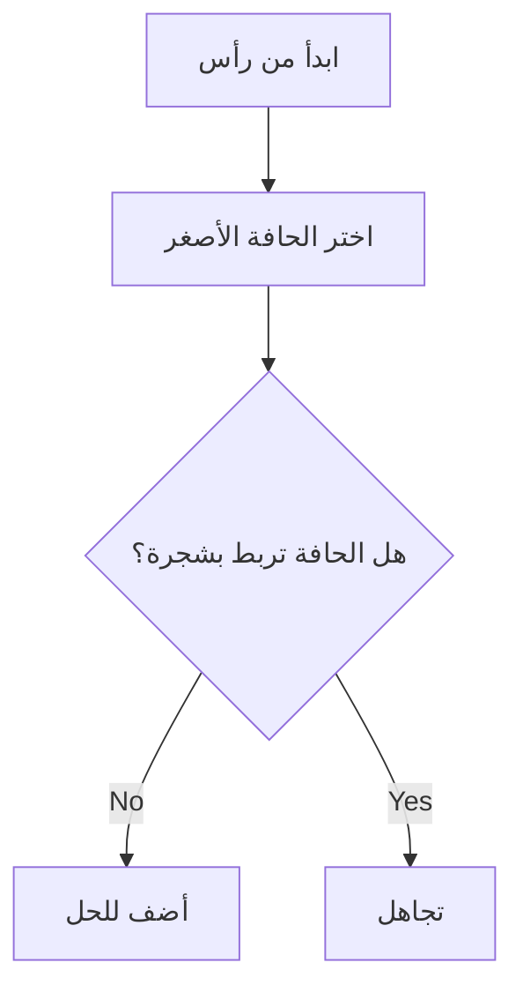

# AI Prompt for Blue Bits Summary Vault
## Universal Prompt - Works with ALL LLMs

---

## 🎯 Universal Prompt

Use this **exact prompt** with any LLM (ChatGPT, Claude, Gemini, Grok, DeepSeek, etc.):

```
أنت خبير أكاديمي في تلخيص المواد الجامعية. أنشئ ملخصاً كاملاً للمقرر التالي وفق المعايير التالية:

## المتطلبات الإلزامية:

1. **الناتج**: Markdown خام فقط (بدون fences، بدون نص إضافي، بدون مقدمة أو خاتمة)
2. **البنية**: كل ## = بطاقة منفصلة في الموقع
3. **العناوين**: عربي مع الإنجليزية بين أقواس: ## 📐 العنوان · English
4. **الرياضيات**: مضمنة $...$ + منفصلة $$...$$ (لا تستخدم \[ \] أو \( \))
5. **الرسوم**: ```mermaid للأنظمة والخرائط الانسيابية
6. **الجداول**: جداول Markdown قياسية
7. **الكود**: ```cpp أو ```python مع شرح
8. **اللغة**: عربية أكاديمية، الإنجليزية بين (أقواس)

## الأقسام المطلوبة:
- ## 📐 التعاريف الأساسية · Core Definitions
- ## 🧮 النظريات والصيغ · Theorems & Formulas
- ## 🔁 الخوارزميات والعمليات · Algorithms & Processes
- ## 📊 الجداول المرجعية · Reference Tables
- ## ⚠️ الأخطاء الشائعة · Common Pitfalls
- ## 📝 ملخص · Summary

## المقرر: [اسم المقرر]
## المنهج: [المواضيع أو ملاحظات المحاضرات]
```

---

## 📋 How to Use

1. **Copy** the universal prompt above
2. **Replace** `[اسم المقرر]` with the course name
3. **Replace** `[المواضيع أو ملاحظات المحاضرات]` with the topics
4. **Paste** into any LLM
5. **Copy** the raw Markdown output
6. **Save** as `courses/[course-id].md`

---

## ✅ Quality Checklist

Before using the output, verify:

- [ ] عناوين عربية مع إنجليزية بين أقواس
- [ ] كل ## = بطاقة منفصلة
- [ ] معادلات LaTeX بـ $inline$ و $$display$$
- [ ] مخطط Mermaid واحد على الأقل (إن أمكن)
- [ ] جداول للجداول المرجعية
- [ ] قسم الأخطاء الشائعة
- [ ] ملخص في النهاية
- [ ] بدون مقدمة أو خاتمة
- [ ] Markdown خام بدون code fences

---

## 📝 Example

**Input to LLM:**
```
المقرر: نظرية المخططات
المنهج: أنواع المخططات، درجات الرؤوس، المصاصة، المستوية، خوارزميات MST (بريم، كروسكال)
```

**Expected Output:**
```markdown
# نظرية المخططات · Graph Theory

## 📐 التعاريف الأساسية · Core Definitions
- المخطط (Graph) `G(V,E)` حيث `V` مجموعة الرؤوس و`E` مجموعة الحواف
- درجة الرأس (Degree): `$\deg(v) = |E(v)|$`

## 🧮 النظريات الأساسية · Basic Theorems
- نظرية مصافقة الأيدي:
  $$\sum_{v \in V} \deg(v) = 2|E|$$

## 🔁 خوارزمية بريم · Prim's Algorithm

- التعقيد: $O(E \log V)$

## 📊 جدول المخططات · Graphs Table
| النوع | |V| | |E| | مستوي؟ |
|-------|---|---|---|---|---|
| `K₅` | 5 | 10 | لا |

## ⚠️ الأخطاء الشائعة · Common Pitfalls
- الخلط بين درجة الرأس ومجموع الدرجات

## 📝 ملخص · Summary
- مصافقة الأيدي قاعدة أساسية
- خوارزميات MST: بريم، كروسكال
```

---

## 💡 Tips for Better Results

1. **Be specific**: Include topics, not just course name
2. **Request math**: Add "استخدم LaTeX للصيغ الرياضية"
3. **Request diagrams**: أضف "أضف مخططات Mermaid"
4. **For code courses**: "أضف كود مع شرح"
5. **For math courses**: "أضف أمثلة محلولة"

---

## 🔧 Course-Specific Variations

### for Math (Calculus, Linear Algebra)
```
أضف: جدول الصيغ الأساسية + أمثلة محلولة خطوة بخطوة
```

### for Programming (Algorithms, Data Structures)
```
أضف: كود ++C أو Python + تعقيد خوارزميات O(n)
```

### for Engineering (Circuits, Signals)
```
أضف: معادلات الدارات + قوانين أساسية + تطبيقات
```

### for Theory (Automata, Graph Theory)
```
أضف: نظريات + براهين + تصنيفات
```

---

*Universal Prompt v2.0 - Works with All LLMs*