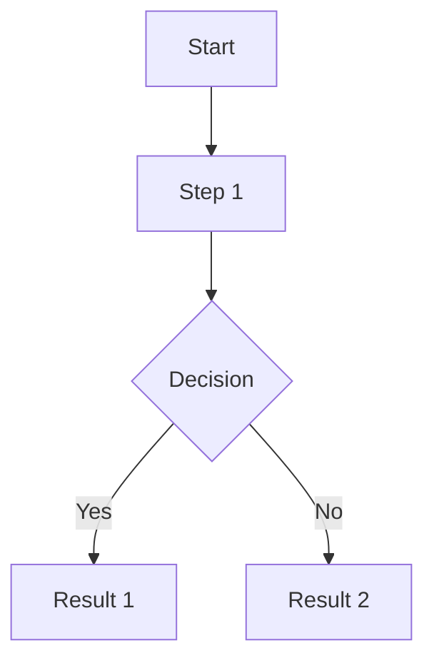
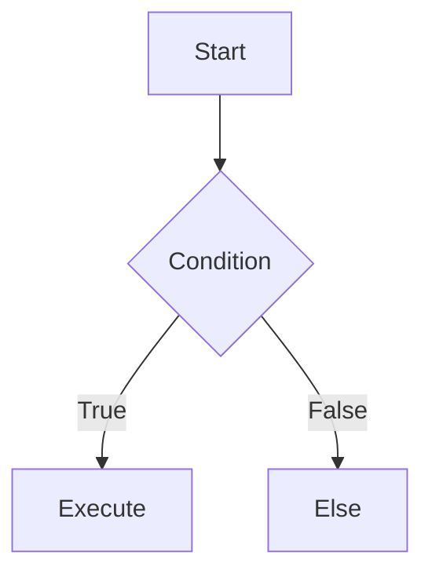

# AI Prompt for Lecture Summary Generation
## Blue Bits Summary Vault Format

Use this prompt with your AI (ChatGPT, Claude, Gemini, etc.) to convert lecture notes/videos into properly formatted course summaries.

---

## 📋 Prompt Template

```
# Create a course summary for [COURSE NAME] following the Blue Bits format

## Course Info:
- **Course Name:** [Arabic Name] · [English Name]
- **University Year:** [Year]
- **Semester:** [1 or 2]
- **Language:** Bilingual Arabic/English

## Format Requirements:

### 1. Structure
Use these Arabic headings with English in parentheses:
- `## 📐 التعاريف الأساسية · Core Definitions` - For key concepts
- `## 🧮 [Topic Name]` - For main topics
- `## 🔁 [Topic Name]` - For processes/flows
- `## 📊 [Topic Name]` - For tables/data
- `## ⚠️ الأخطاء الشائعة · Common Pitfalls` - For mistakes to avoid
- `## 📝 ملخص · Summary` - For final summary

### 2. Content Cards (Each h2 section = one card)
- Group content under each ## heading into a card
- Use bullet points for definitions
- Keep content concise but comprehensive

### 3. LaTeX Math Formulas
- Inline: `$formula$` 
- Display: `$$formula$$`
- Examples:
  - Variables: `$x$, $y$, $n$, $i$`
  - Fractions: `$\frac{a}{b}$`
  - Exponents: `$x^2$, $e^x$`
  - Roots: `$\sqrt{x}$, $\sqrt[3]{x}$`
  - Greek: `$\alpha$, $\beta$, $\gamma$, $\theta$, $\pi$`
  - Summation: `$\sum_{i=1}^{n}$`
  - Integral: `$\int_{a}^{b} f(x) dx$`
  - Matrix: `$A = \begin{pmatrix} a & b \\ c & d \end{pmatrix}$`

### 4. Mermaid Diagrams
Include one diagram per major topic using:


Diagram types:
- Flowcharts: `graph TD` or `graph LR`
- Sequence: `sequenceDiagram`
- State: `stateDiagram-v2`

### 5. Tables
Use markdown tables for:
- Comparisons
- Classifications
- Formula summaries

Example:
| Concept | Description | Formula |
|---------|-------------|---------|
| X | Y | Z |

### 6. Code Blocks
For any code:
```cpp
// or python, java, etc.
code here
```

### 7. Important Guidelines:
- Always use Arabic headings first, English in parentheses
- Keep English terms in parentheses after Arabic
- Use emojis as section icons
- Include 3-5 common mistakes in "الأخطاء الشائعة" section
- Each section should be substantial but not overwhelming
- Add "المراجع" (References) at the end with source info

## Output Format:
Generate the complete markdown file ready to use on the website.
```

---

## 📝 Example Output (for reference):

```markdown
# برمجة 1 · Programming 1

## 📐 التعاريف الأساسية · Core Definitions

- **المتغير (Variable)**: موقع في الذاكرة يخزن قيمة
- **نوع البيانات (Data Type)**: تصنيف القيم المخزنة
- **بنية التحكم (Control Flow)**: ترتيب تنفيذ التعليمات

## 🧮 الأنواع والبيانات · Data Types

### الأنواع الأساسية · Primitive Types

| النوع | الحجم | النطاق |
|---|---|---|
| `int` | 4 bytes | $-2^{31}$ إلى $2^{31}-1$ |
| `float` | 4 bytes | $\pm3.4 \times 10^{\pm38}$ |

$$type\_name variable\_name = value;$$

## 🔁 التحكم في التدفق · Control Flow



## ⚠️ الأخطاء الشائعة · Common Pitfalls

1. نسيان فاصلة منقوطة في نهاية التعليمة
2. الخلط بين `=` و `==` في المقارنة
3. عدم تعريف المتغير قبل استخدامه

## 📝 ملخص · Summary

- المتغيرات هي أساس البرمجة
- أنواع البيانات تحدد القيم المقبولة
- هياكل التحكم تحدد مسار التنفيذ

---

**المراجع**: محاضرات المادة، جامعة Aleppo
```

---

## 🎯 Quick Copy-Paste Prompts

### For Computer Science Courses:
```
Create a detailed course summary for [COURSE NAME] in Arabic/English bilingual format. 
Include: definitions, formulas (use LaTeX $...$), tables, one Mermaid diagram, 
and common mistakes section. 
Structure: Each ## heading = one card in the final output.
```

### For Math/Physics Courses:
```
Create a comprehensive summary with:
- All formulas in LaTeX ($inline$ and $$display$$)
- Step-by-step derivations
- Key theorems and proofs
- Example problems
- Common mistakes students make
```

### For Engineering Courses:
```
Generate lecture notes summary with:
- Technical terminology (Arabic/English)
- Circuit diagrams or flowcharts as Mermaid
- Formula tables
- Practical applications
- Error prevention tips
```

---

## ✅ Checklist for AI Output:

- [ ] Arabic headings with English in parentheses
- [ ] Each major topic under ## is a separate card
- [ ] LaTeX formulas for all math ($...$ or $$...$$)
- [ ] At least one Mermaid diagram
- [ ] Tables for comparisons/classifications
- [ ] Code blocks for any programming
- [ ] Common mistakes section
- [ ] Summary at the end
- [ ] References/sources

---

## 💡 Tips for Best Results:

1. **Provide context**: Tell AI the course name, year, semester
2. **Specify format**: Remind about Arabic/English headings
3. **Request LaTeX**: Explicitly ask for math formulas
4. **Ask for diagrams**: Request Mermaid for flows
5. **Include examples**: Give the example above as reference

---

*Generated for Blue Bits Summary Vault - University Course Summaries*